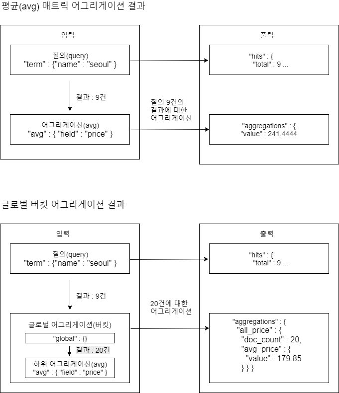

# 어그리게이션

[aggregation of docs](https://www.elastic.co/guide/en/elasticsearch/reference/current/search-facets.html)

---

### 6.1 어그리게이션

> aggregation

<pre>
"aggregations" : {
    "&lt;aggregation_name&gt;" : {
        "&lt;aggregation_type&gt;" : {
            &lt;aggregation_body&gt;
        }
        [,"meta" : {  [&lt;meta_data_body&gt;] } ]?
        [,"aggregations" : { [&lt;sub_aggregation&gt;]+ } ]?
    }
    [,"&lt;aggregation_name_2&gt;" : { ... } ]*
}
</pre>

> save datas(6_1_hotels.json)

<pre>
[root@localhost datas]# curl -XPOST localhost:9200/\_bulk --data-binary \@6_1_hotels.json
structure
"\_source": {
  "name": "Grand Hyatt Seoul",
  "stars": 5,
  "rooms": 585,
  "location": {
    "lat": 37.539031,
    "lon": 126.997521
    },
  "city": "Seoul",
  "address": "322 Sowol-ro, Yongsan-gu Seoul Seoul 140-738 South Korea",
  "price": 292,
  "internet": true,
  "service": [
    "Health Club",
    "Swimming pool",
    "Spa",
    "Sauna",
    "Valet parking"
  ],
  "checkin": "2014-03-07T11:00:00"
}
</pre>

#### 6.1.1최소, 최대, 합, 평균, 개수 어그리게이션

> hotels 인덱스 docs의 price 필드의 최소, 최대, 합, 평균, 개수

<pre>
curl 'localhost:9200/hotels/\_search?pretty' -d '
{
  "aggs" : {
    "price_min" : {
      "min" : {"field" : "price"}
    },
    "price_max" : {
      "max" : {"field" : "price"}
    },
    "price_sum" : {
      "sum" : {"field" : "price"}
    },
    "price_avg" : {
      "avg" : {"field" : "price"}
    },
    "price_cnt" : {
      "value_count" : {"field" : "price"}
    }
  }
}
'
... 중략
"aggregations" : {
  "price_cnt" : {
    "value" : 20
    },
  "price_sum" : {
    "value" : 3597.0
  },
  "price_min" : {
    "value" : 54.0
  },
  "price_avg" : {
    "value" : 179.85
  },
  "price_max" : {
    "value" : 380.0
  }
}
</pre>

---

#### 6.1.2 상태, 확장 상태 어그리게이션

<pre>
curl 'localhost:9200/hotels/\_search?pretty' -d '
{
  "aggs" : {
    "price_stats" : {
      "stats" : {"field" : "price"}      
    },
    "price_extended_stats" : {
      "extended_stats" : {"field" : "price"}
    }
  }
}
'
... 중략 ...
"aggregations" : {
  "price_extended_stats" : {
    "count" : 20,
    "min" : 54.0,
    "max" : 380.0,
    "avg" : 179.85,
    "sum" : 3597.0,
    "sum_of_squares" : 833373.0,
    "variance" : 9322.627500000002,
    "std_deviation" : 96.5537544583327,
    "std_deviation_bounds" : {
      "upper" : 372.9575089166654,
      "lower" : -13.257508916665415
    }
  },
  "price_stats" : {
    "count" : 20,
    "min" : 54.0,
    "max" : 380.0,
    "avg" : 179.85,
    "sum" : 3597.0
  }
}
</pre>

---

#### 6.1.3 글로벌 어그리게이션
; 검색 범위의 인덱스나 타입에 해당하는 모든 도큐먼트를 하나의 버킷에  
모두 담는 버킷 어그리게이션 & 질의에 영향X

> name 필드에 seoul을 포함한 도큐먼트의 평균 price

<pre>
curl 'localhost:9200/hotels/\_search?pretty' -d '
{  
  "query" : {
    "term" : {"name" : "seoul"}
  },
  "aggs" : {
    "avg_price" : {
      "avg" : {"field" : "price"}
    }
  }
}
'
...중략 ...
"aggregations" : {
  "avg_price" : {
    "value" : 241.44444444444446
  }
}
</pre>

<pre>
curl 'localhost:9200/hotels/\_search?pretty' -d '
{  
  "query" : {
    "term" : {"name" : "seoul"}
  },
  "aggs" : {
    "all_price" : {
      "global" : {},
      "aggs" : {
        "avg_price" : {
          "avg" : {"field" : "price"}
        }
      }
    }
  }
}
'
... 중략...
"aggregations" : {
  "all_price" : {
    "doc_count" : 20,
    "avg_price" : {
      "value" : 179.85
    }
  }
}
</pre>

---

#### 필터, 누락 어그리게이션

> 필터 어그리게이션 버킷에 담긴 도큐먼트의 price 평균

<pre>
curl 'localhost:9200/hotels/\_search?pretty' -d '
{
  "aggs" : {
    "filter_name" : {
      "filter" : {"term" : {"name" : "seoul"}},
      "aggs" : {
        "avg_price" : {
          "avg" : {"field" : "price"}
        }
      }    
    }
  }
}
'
... 중략 ...
"aggregations" : {
  "filter_name" : {
    "doc_count" : 9, // "name" 필드의 값이 "seoul" 인 doc 수
    "avg_price" : {
      "value" : 241.44444444444446 // 위의 9개 docs의 "price" 필드의 평균
    }
  }
}
</pre>

> service 필드가 존재하지 않는 도큐먼트의 price 평균

<pre>
curl 'localhost:9200/hotels/\_search?pretty' -d '
{
  "aggs" : {
    "missing_service" : {
      "missing" : {"field" : "service"},
      "aggs" : {
        "avg_price" : {
          "avg" : {"field" : "price"}
        }
      }
    }
  }
}
'
...중략...
"aggregations" : {
  "missing_service" : {
    "doc_count" : 5,
    "avg_price" : {
      "value" : 76.0
    }
  }
}
</pre>

---

#### 텀 어그리게이션
; 검색 된 텀별로 버킷을 생성

<pre>
curl 'localhost:9200/hotels/\_search?pretty' -d '
{
  "aggs" : {
    "term_stars" : {
      "terms" : {"field" : "stars"},
      "aggs" : {
        "avg_price" : {
          "avg" : {"field" : "price"}
        }
      }
    }
  }
}
'
... 중략
"aggregations" : {
   "term_stars" : {
     "doc_count_error_upper_bound" : 0,
     "sum_other_doc_count" : 0,
     "buckets" : [ {
       "key" : 3,
       "doc_count" : 8,
       "avg_price" : {
         "value" : 121.5
       }
     }, {
       "key" : 5,
       "doc_count" : 5,
       "avg_price" : {
         "value" : 309.6
       }
     }, {
       "key" : 4,
       "doc_count" : 4,
       "avg_price" : {
         "value" : 221.0
       }
     }, {
       "key" : 2,
       "doc_count" : 3,
       "avg_price" : {
         "value" : 64.33333333333333
       }
     } ]
   }
 }
</pre>

> 상위 3개의 텀 어그리게이션 검색  

<pre>
curl 'localhost:9200/hotels/\_search?pretty' -d '
{  
  "query" : {
    "term" : {"name" : "seoul"}
  },
  "aggs" : {
    "term_service" : {
      "terms" : {
        "field" : "service",
        "size" : 3
      }
    }
  }
}'
... 중략
"aggregations" : {
  "term_service" : {
    "doc_count_error_upper_bound" : 0,
    "sum_other_doc_count" : 24,
    "buckets" : [ {
      "key" : "coffee",
      "doc_count" : 5
    }, {
      "key" : "shop",
      "doc_count" : 5
    }, {
      "key" : "conference",
      "doc_count" : 3
    } ]
  }
}
</pre>

**order를 이용해 정렬**  
- {"\_count" : "asc | desc"} : 텀의 결과 개수가 정렬
- {"\_term" : "asc | desc"} : 텀의 알파벳 정렬

> 텀의 알파벳 오름 차순

<pre>
[root@localhost datas]# curl 'localhost:9200/hotels/\_search?pretty' -d '
{  
  "query" : {
    "term" : {"name" : "seoul"}
  },
  "aggs" : {
    "term_service" : {
      "terms" : {
        "field" : "service",
        "order" : { "\_term" : "asc" }
      }
    }
  }
}'
...중략...
"aggregations" : {
  "term_service" : {
    "doc_count_error_upper_bound" : 0,
    "sum_other_doc_count" : 18,
    "buckets" : [ {
      "key" : "arcade",
      "doc_count" : 1
    }, {
      "key" : "bar",
      "doc_count" : 1
    }, {
      "key" : "center",
      "doc_count" : 1
    }, {
      "key" : "club",
      "doc_count" : 2
    }, {
      "key" : "coffee",
      "doc_count" : 5
    }, {
      "key" : "conference",
      "doc_count" : 3
    }, {
      "key" : "game",
      "doc_count" : 1
    }, {
      "key" : "health",
      "doc_count" : 2
    }, {
      "key" : "parking",
      "doc_count" : 2
    }, {
      "key" : "pool",
      "doc_count" : 1
    } ]
  }
}
</pre>

> avg_price 하위 어그리게이션 값으로 오름차순 정렬

<pre>
[root@localhost datas]# curl 'localhost:9200/hotels/\_search?pretty' -d '
{
  "aggs" : {
    "term_stars" : {
      "terms" : {
        "field" : "stars",
        "order" : {"avg_price" : "asc"}
      },
      "aggs" : {
        "avg_price" : {
          "avg" : {"field" : "price"}
        }
      }
    }
  }
}
'
... 중략
"aggregations" : {
    "term_stars" : {
      "doc_count_error_upper_bound" : 0,
      "sum_other_doc_count" : 0,
      "buckets" : [ {
        "key" : 2,
        "doc_count" : 3,
        "avg_price" : {
          "value" : 64.33333333333333
        }
      }, {
        "key" : 3,
        "doc_count" : 8,
        "avg_price" : {
          "value" : 121.5
        }
      }, {
        "key" : 4,
        "doc_count" : 4,
        "avg_price" : {
          "value" : 221.0
        }
      }, {
        "key" : 5,
        "doc_count" : 5,
        "avg_price" : {
          "value" : 309.6
        }
      } ]
    }
  }
</pre>

---

#### 6.1.6 범위 날짜 어그리게이션

> romms 필드의 50 간격으로 price 평균 값 계산

<pre>
[root@localhost datas]# curl 'localhost:9200/hotels/_search?pretty' -d '
{
  "aggs" : {
    "range_room" : {
      "range" : {
        "field" : "rooms",
        "ranges" : [
          {"to" : 500},
          {"from" : 500, "to" : 1000},
          {"from" : 1000}
        ]
      },
      "aggs" : {
        "avg_price" : {
          "avg" : {"field" : "price"}
        }
      }
    }
  }
}
'
... 중략 ...
"aggregations" : {
    "range_room" : {
      "buckets" : [ {
        "key" : "*-500.0",
        "to" : 500.0,
        "to_as_string" : "500.0",
        "doc_count" : 16,
        "avg_price" : {
          "value" : 156.1875
        }
      }, {
        "key" : "500.0-1000.0",
        "from" : 500.0,
        "from_as_string" : "500.0",
        "to" : 1000.0,
        "to_as_string" : "1000.0",
        "doc_count" : 3,
        "avg_price" : {
          "value" : 259.3333333333333
        }
      }, {
        "key" : "1000.0-*",
        "from" : 1000.0,
        "from_as_string" : "1000.0",
        "doc_count" : 1,
        "avg_price" : {
          "value" : 320.0
        }
      } ]
    }
  }
</pre>

> range 어그리게이션 버킷에 키 속성 추가

<pre>
curl 'localhost:9200/hotels/_search?pretty' -d '
{
  "aggs" : {
    "range_room" : {
      "range" : {
        "field" : "rooms",
		"keyed" : true,
        "ranges" : [
          {"to" : 500},
          {"from" : 500, "to" : 1000},
          {"from" : 1000}
        ]
      },
      "aggs" : {
        "avg_price" : {
          "avg" : {"field" : "price"}
        }
      }
    }
  }
}
'
"aggregations" : {
   "range_room" : {
     "buckets" : {
       "*-500.0" : {
         ...중략...
       },
       "500.0-1000.0" : {
         ...중략...
       },
       "1000.0-*" : {
         ...중략...
       }
     }
   }
 }
</pre>

> date_range 어그리게이션을 이용해서 날짜 범위 구분  

<pre>
curl 'localhost:9200/hotels/_search?pretty' -d '
{
  "aggs" : {
    "date_r_checkin" : {
      "date_range" : {
        "field" : "checkin",
        "format" : "yyyy-MM-dd",
        "ranges" : [
          {"to" : "now-4M"},
          //{"to" : "now-4M"},
          {"from" : "now-4M"}
        ]
      }
    }
  }
}
'
...중략...
"aggregations" : {
  "date_r_checkin" : {
    "buckets" : [ {
      "key" : "*-2017-04-19",
      "to" : 1.492626295495E12,
      "to_as_string" : "2017-04-19",
      "doc_count" : 20
    }, {
      "key" : "2017-04-19-*",
      "from" : 1.492626295495E12,
      "from_as_string" : "2017-04-19",
      "doc_count" : 0
    } ]
  }
}
</pre>

<pre>
curl 'localhost:9200/hotels/_search?pretty' -d '
{
  "aggs" : {
    "date_r_checkin" : {
      "date_range" : {
        "field" : "checkin",
        "format" : "yyyy-MM-dd",
        "ranges" : [
          {"to" : "2014-03-05"},          
          {"from" : "2014-03-05"}
        ]
      }
    }
  }
}
'
... 중략 ...
"aggregations" : {
  "date_r_checkin" : {
    "buckets" : [ {
      "key" : "*-2014-03-05",
      "to" : 1.3939776E12,
      "to_as_string" : "2014-03-05",
      "doc_count" : 7
    }, {
      "key" : "2014-03-05-*",
      "from" : 1.3939776E12,
      "from_as_string" : "2014-03-05",
      "doc_count" : 13
    } ]
  }
}
</pre>

---

#### 6.1.7 히스토그램, 날짜 히스토그램 어그리게이션
;나눌 간격이 일정하다면 히스토그램을 사용  

> rooms 필드의 값을 100 간격으로 구분

<pre>
curl 'localhost:9200/hotels/_search?pretty' -d '
{
  "aggs" : {
    "histo_rooms" : {
      "histogram" : {
        "field" : "rooms",
        "interval" : 100
      }
    }
  }
}
'
... 중략 ...
"aggregations" : {
"histo_rooms" : {
  "buckets" : [ {
    "key" : 0,
    "doc_count" : 7
  }, {
    "key" : 100,
    "doc_count" : 3
  },
  ... 중략 ...
}
</pre>

> rooms 필드를 100간격으로 구분 & price 값을 집계

<pre>
curl 'localhost:9200/hotels/_search?pretty' -d '
{
  "aggs" : {
    "histo_rooms" : {
      "histogram" : {
        "field" : "rooms",
        "interval" : 100,
        "min_doc_count" : 0 //doc의 0개 인것도 포함 (기본은 포함X)
      },
      "aggs" : {
        "price_stats" : {
          "stats" : {"field" : "price"}
        }
      }    
    }    
  }
}
'
... 중략 ...
"aggregations" : {
  "histo_rooms" : {
    "buckets" : [ {
      "key" : 0,
      "doc_count" : 7,
      "price_stats" : {
        "count" : 7,
        "min" : 54.0,
        "max" : 182.0,
        "avg" : 92.57142857142857,
        "sum" : 648.0
      }
    }, {
      "key" : 100,
      "doc_count" : 3,
      "price_stats" : {
        "count" : 3,
        "min" : 98.0,
        "max" : 148.0,
        "avg" : 121.66666666666667,
        "sum" : 365.0
      }
    },
    ...중략..
</pre>

- \_count : 버킷에 담긴 도큐먼트 개수로 정렬
- \_key : 히스토그램을 나누는 키값 순서대로 정렬
- 하위 어그리게이션명 : 하위 어그리게이션의 결과값 기준으로 정렬

> stats 하위 어그리게이션의 sum 값을 오름차순 정렬

<pre>
curl 'localhost:9200/hotels/_search?pretty' -d '
{
  "aggs" : {
    "histo_rooms" : {
      "histogram" : {
        "field" : "rooms",
        "interval" : 300,
        "order" : {"state_room.sum" : "asc"}
      },
      "aggs" : {
        "state_room" : {
          "stats" : {} //상위 어그리게이션 사용 된 필드를 사용
        }
      }
    }
  }
}
'
...중략...
"aggregations" : {
   "histo_rooms" : {
     "buckets" : [ {
       "key" : 900,
       "doc_count" : 0,
       "state_room" : {
         "count" : 0,
         "min" : null,
         "max" : null,
         "avg" : null,
         "sum" : null
       }
     }, {
       "key" : 600,
       "doc_count" : 1,
       "state_room" : {
         "count" : 1,
         "min" : 613.0,
         "max" : 613.0,
         "avg" : 613.0,
         "sum" : 613.0
       }
     }, {
       "key" : 0,
       "doc_count" : 11,
       "state_room" : {
         "count" : 11,
         "min" : 17.0,
         "max" : 201.0,
         "avg" : 78.72727272727273,
         "sum" : 866.0
       }
     }, {
       "key" : 1200,
       "doc_count" : 1,
       "state_room" : {
         "count" : 1,
         "min" : 1479.0,
         "max" : 1479.0,
         "avg" : 1479.0,
         "sum" : 1479.0
       }
     }, {
       "key" : 300,
       "doc_count" : 7,
       "state_room" : {
         "count" : 7,
         "min" : 312.0,
         "max" : 585.0,
         "avg" : 426.14285714285717,
         "sum" : 2983.0
       }
     } ]
   }
 }
</pre>

**날짜 히스토그램**  

> 날짜 히스토그램을 이용해 1개월 간격으로 checkin 필드 구분

<pre>
curl 'localhost:9200/hotels/_search?pretty' -d '
{
  "aggs" : {
    "histo_checkin" : {
      "date_histogram" : {
        "field" : "checkin",
        "interval" : "1M",
        "format" : "yyyy-MM-dd E"
      }
    }
  }
}
'
"aggregations" : {
  "histo_checkin" : {
    "buckets" : [ {
      "key_as_string" : "2014-02-01 Sat",
      "key" : 1391212800000,
      "doc_count" : 6
    }, {
      "key_as_string" : "2014-03-01 Sat",
      "key" : 1393632000000,
      "doc_count" : 8
    }, {
      "key_as_string" : "2014-04-01 Tue",
      "key" : 1396310400000,
      "doc_count" : 5
    }, {
      "key_as_string" : "2014-05-01 Thu",
      "key" : 1398902400000,
      "doc_count" : 1
    } ]
  }
}
</pre>

---
