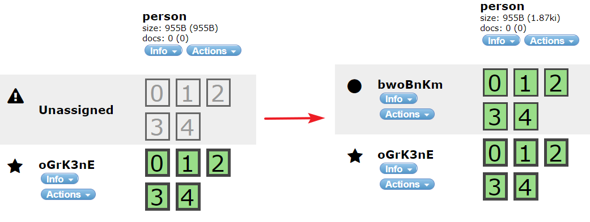

# ch09. 스케일 아웃

- 엘라스틱서치 클러스터에 노드 추가하기
- 엘라스틱서치 클러스터에서 마스터 선출
- 노드를 제거하거나 해체하기
- _cat API를 사용하여 클러스터 살펴보기  
- 계획 수립 및 스케일링 전략
- 앨리어스와 커스텀 라우팅  

---  

## index  

- <a href="#9.1">9.1 엘라스틱서치 클러스터에 노드를 추가하기</a>
- <a href="#9.2">9.2 다른 엘라스틱서치 노드 발견하기  </a>


---  

> 확장성?  
=> 색인과 검색을 더 많이 다루거나 빠르게 다룰 수 있는 능력 등  

<div id="9.1"></div>
## 9.1 엘라스틱서치 클러스터에 노드를 추가하기  

### 9.1.1 엘라스틱서치 클러스터에 노드 추가하기  

=> 별도의 폴더 & elasticsearch.yml에서 cluster.name 같게 명시  



```
[app@localhost config]$ curl -XGET 'http://localhost:9200/_cluster/health?pretty'
{
  "cluster_name" : "test",
  "status" : "green",
  "timed_out" : false,
  // 노드 정보
  "number_of_nodes" : 2,
  "number_of_data_nodes" : 2,
  "active_primary_shards" : 36,
  "active_shards" : 67,
  "relocating_shards" : 0,
  "initializing_shards" : 0,
  // 할당되지 않은 샤드 수
  "unassigned_shards" : 0,
  "delayed_unassigned_shards" : 0,
  "number_of_pending_tasks" : 0,
  "number_of_in_flight_fetch" : 0,
  "task_max_waiting_in_queue_millis" : 0,
  "ac
```  

=> 노드가 추가되면 자동으로 모든 노드에 걸쳐서 샤드들을 균등하게 분배  
(하나의 노드에 같은 샤드X)  
=> 주가 고가용성 + 전반적으로 성능 향상  
(주를 찾을 수 없는 경우 레플리카 샤드를 주로 승격)  

<div id="9.2"></div>  

## 9.2 다른 엘라스틱서치 노드 발견하기  
;멀티캐스트 or 유니캐스트를 사용해 다른 노드를 발견  
(5.x 이후로 Multicast Discovery 삭제)   
https://www.elastic.co/guide/en/elasticsearch/plugins/5.0/discovery-multicast.html  

### 9.2.2 유니캐스트 디스커버리  
=> 노드의 IP 주소가 자주 변경되지 않거나 네트워크 전체가 아닌 특정 노드끼리만  
서로 통신하여야 하는 환경의 ES라면 이상적  

> elasticsearch.yml  

```
discovery.zen.ping.unicast.hosts: ["192.168.0.22", "192.168.0.23"]
```  

=> 모든 노드 주소를 입력할 필요는 없지만, 충분히 많은 주소를 설정하여  
각 노드가 탐지꾼 노드와 통신할 수 있도록 하여야 한다  
(예를들어 전체 7개의 노드 중 목록의 첫번째 노드가 3개를 알고, 두번쨰가 4개를 알면 끝)  

### 9.2.3 마스터 선출 및 장애 감지  
; 마스터 노드 = 클러스터의 상태를 관리  
(현재 설정 값, 샤드, 색인, 노드들의 상태)  

=> node.master를 faslse로 하지 않는 이상 모든 노드가 마스터가 될 수 있다고 판단  

=> 여러 노드로 구성된 프로덕션의 경우 마스터 노드의 최소 개수를 정하는 것이  
좋은 방법이 될 수 있음  
(복수 개의 마스터 노드가 아니라, 클러스터가 정상적인 상태가 되기 이전에  
클러스터에 있는 노드 중 얼마나 많은 노드가 마스터가 될 수 있는가)  

> 설정  

```
# Prevent the "split brain" by configuring the majority of nodes (total number of master-eligible nodes / 2 + 1):
#
#discovery.zen.minimum_master_nodes: 3
```  

> 스플릿 브레인이란?  

```
클러스터에 속한 하나 혹은 여러 개의 노드가, 마스터 노드와 통신하지 못하고  
새로운 마스터를 선출하여 요청을 처리하고 있는 상황  
=> discovery.zen.minimum_master_nodes = (전체노드수+1)/2
=> 하나 or 두 개의 노드가 다른 노드로부터 연결이 끊어지더라도,  
마스터가 될 자격이 있는 노드들의 정족수가 채워지지 않으므로  
새로 마스터를 선충하여 별도의 클러스터를 형성하지 않기 떄문
```

> master node 확인  

```
[app@localhost elasticsearch1]$ curl 'http://localhost:9200/_cluster/state/master_node,nodes?pretty'
{
  "cluster_name" : "test",
  "master_node" : "oGrK3nEsSR6zIZfNsYz30Q",
  "nodes" : {
    "bwoBnKmxTwGHXUxGpzDFMA" : {
      "name" : "bwoBnKm",
      "ephemeral_id" : "o_oRbwRWQMqSwIfGkpKLXg",
      "transport_address" : "192.168.5.77:9301",
      "attributes" : { }
    },
    "oGrK3nEsSR6zIZfNsYz30Q" : {
      "name" : "oGrK3nE",
      "ephemeral_id" : "FGpV8OGoQAucHISJs0Ie5Q",
      "transport_address" : "192.168.5.77:9300",
      "attributes" : { }
    }
  }
}
```
