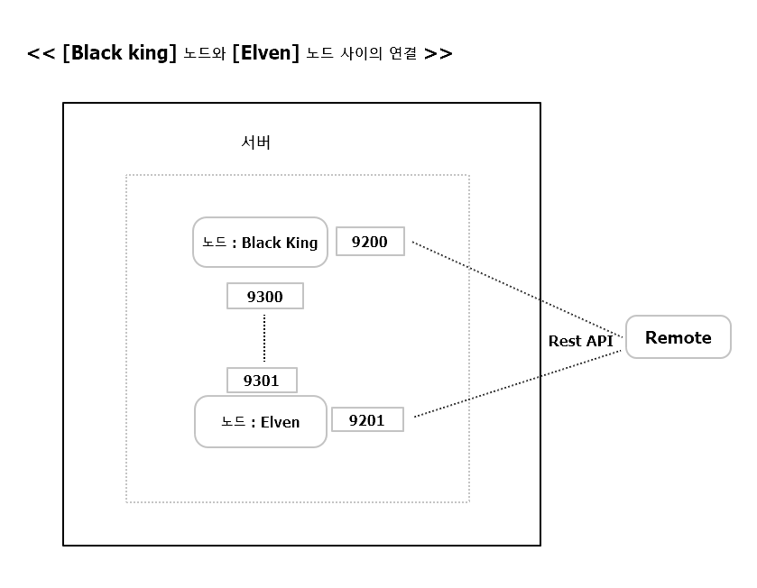

## Reference

[시작하세요!엘라스틱 서치](http://book.naver.com/bookdb/book_detail.nhn?bid=8769630)

## 시스템 구조

- 시스템 단위 : 클러스터
- 프로세스 단위 : 노드
- 색인 된 데이터를 저장하는 메커니즘 : 샤드 , 복사본

---

### 4.1 클러스터와 노드


**클러스터(Cluster)**  
-> 하나 이상의 노드로 이루어져 있음  
-> 같은 시스템 or 네트워크 바인딩이 되도록 설정한 다른 시스템에서  
같은 클러스터명으로 설정된 ES를 실행하면 또다시 임의의 새로운 노드가 실행되면서  
두 개의 노드는 하나의 클러스터로 바인딩 되어 묶임  
-> 클러스터명을 같게 유지하는 것만으로 쉽게 하나의 시스템으로 묶는 건 큰 장점  


#### 4.1.1 노드 바인딩


> install plugin  

```# bin/plugin --install mobz/elasticsearch-head```

> configurer elasticsearch.yml

<pre>
13 # ---------------------------------- Cluster -----------------------------------
14 #
15 # Use a descriptive name for your cluster:
16 #
17  cluster.name: es_test
18 #
</pre>

> Run es [Node1 : Black king]

<pre>
[root@localhost elasticsearch-2.4.4]# bin/elasticsearch -Des.insecure.allow.root=true
1. [2017-08-13 13:52:09,346][WARN ][bootstrap                ] running as ROOT user. this is a bad idea!
2. [2017-08-13 13:52:09,465][INFO ][node                     ] [Black King] version[2.4.4], pid[3565], build[fcbb46d/2017-01-03T11:33:16Z]
3. [2017-08-13 13:52:09,465][INFO ][node                     ] [Black King] initializing ...
4. [2017-08-13 13:52:09,872][INFO ][plugins                  ] [Black King] modules [reindex, lang-expression, lang-groovy], plugins [head], sites [head]
5. [2017-08-13 13:52:09,892][INFO ][env                      ] [Black King] using [1] data paths, mounts [[/ (rootfs)]], net usable_space [41.2gb], net total_space [49.9gb], spins? [unknown], types [rootfs]
6. [2017-08-13 13:52:09,892][INFO ][env                      ] [Black King] heap size [990.7mb], compressed ordinary object pointers [true]
7. [2017-08-13 13:52:09,892][WARN ][env                      ] [Black King] max file descriptors [4096] for elasticsearch process likely too low, consider increasing to at least [65536]
8. [2017-08-13 13:52:11,170][INFO ][node                     ] [Black King] initialized
9. [2017-08-13 13:52:11,170][INFO ][node                     ] [Black King] starting ...
10. [2017-08-13 13:52:11,223][INFO ][transport                ] [Black King] publish_address {127.0.0.1:9300}, bound_addresses {[::1]:9300}, {127.0.0.1:9300}
11. [2017-08-13 13:52:11,228][INFO ][discovery                ] [Black King] es_test/Mbf4tvavTlyHAIXAXJa5OQ
12. [2017-08-13 13:52:15,326][INFO ][cluster.service          ] [Black King] new_master {Black King}{Mbf4tvavTlyHAIXAXJa5OQ}{127.0.0.1}{127.0.0.1:9300}, reason: zen-disco-join(elected_as_master, [0] joins received)
13. [2017-08-13 13:52:15,930][INFO ][http                     ] [Black King] publish_address {127.0.0.1:9200}, bound_addresses {[::1]:9200}, {127.0.0.1:9200}
14. [2017-08-13 13:52:15,930][INFO ][node                     ] [Black King] started
15. [2017-08-13 13:52:15,934][INFO ][gateway                  ] [Black King] recovered [7] indices into cluster_state
16. [2017-08-13 13:52:16,886][INFO ][cluster.routing.allocation] [Black King] Cluster health status changed from [RED] to [YELLOW] (reason: [shards started [[book][0]] ...]).
</pre>

- 10. [transport                ] [Black King] ...  
  : 9300 포트를 사용해 데이터 통신
- 11. [discovery                ] ...  
  : 클러스터명이 es_test로 실행
- 12. [cluster.service          ] ...  
  : 현재 실행된 노드가 마스터 노드로 선출
- 13. [http                     ] ...  
  : http 통신, i.e REST API가 9200포트를 통해서 실행


> Run another es [Node2 : Elven]

<pre>
1. [root@localhost elasticsearch-2.4.4]# bin/elasticsearch -Des.insecure.allow.root=true
2. [2017-08-13 13:58:12,294][WARN ][bootstrap                ] running as ROOT user. this is a bad idea!
3. [2017-08-13 13:58:12,480][INFO ][node                     ] [Elven] version[2.4.4], pid[3778], build[fcbb46d/2017-01-03T11:33:16Z]
4. [2017-08-13 13:58:12,480][INFO ][node                     ] [Elven] initializing ...
5. [2017-08-13 13:58:12,974][INFO ][plugins                  ] [Elven] modules [reindex, lang-expression, lang-groovy], plugins [head], sites [head]
6. [2017-08-13 13:58:12,993][INFO ][env                      ] [Elven] using [1] data paths, mounts [[/ (rootfs)]], net usable_space [41.2gb], net total_space [49.9gb], spins? [unknown], types [rootfs]
7. [2017-08-13 13:58:12,993][INFO ][env                      ] [Elven] heap size [990.7mb], compressed ordinary object pointers [true]
8. [2017-08-13 13:58:12,993][WARN ][env                      ] [Elven] max file descriptors [4096] for elasticsearch process likely too low, consider increasing to at least [65536]
9. [2017-08-13 13:58:14,446][INFO ][node                     ] [Elven] initialized
10. [2017-08-13 13:58:14,446][INFO ][node                     ] [Elven] starting ...
11. [2017-08-13 13:58:14,511][INFO ][transport                ] [Elven] publish_address {127.0.0.1:9301}, bound_addresses {[::1]:9301}, {127.0.0.1:9301}
12. [2017-08-13 13:58:14,516][INFO ][discovery                ] [Elven] es_test/WTKk8UPNSR2FXyoR9NQHeA
13. [2017-08-13 13:58:17,653][INFO ][cluster.service          ] [Elven] detected_master {Black King}{Mbf4tvavTlyHAIXAXJa5OQ}{127.0.0.1}{127.0.0.1:9300}, added {{Black King}{Mbf4tvavTlyHAIXAXJa5OQ}{127.0.0.1}{127.0.0.1:9300},}, reason: zen-disco-receive(from master [{Black King}{Mbf4tvavTlyHAIXAXJa5OQ}{127.0.0.1}{127.0.0.1:9300}])
14. [2017-08-13 13:58:17,741][INFO ][http                     ] [Elven] publish_address {127.0.0.1:9201}, bound_addresses {[::1]:9201}, {127.0.0.1:9201}
15. [2017-08-13 13:58:17,742][INFO ][node                     ] [Elven] started
</pre>

- [Elven] 노드로 실행
- 11. [transport                ] ...  
  : 9301 포트를 통해 데이터 통신
- 13. [cluster.service          ] ...  
  : [Black King]인 마스터 노드를 찾았고, 이 노드와 9300번 포트를 통해 바인딩
- 14. [http                     ] ...  
  : http 통신, i.e REST API가 9201 포트를 통해서 실행


> Check [Node1 : Black king]

<pre>
[2017-08-13 13:58:17,641][INFO ][cluster.service          ] [Black King] added {{Elven}{WTKk8UPNSR2FXyoR9NQHeA}{127.0.0.1}{127.0.0.1:9301},}, reason: zen-disco-join(join from node[{Elven}{WTKk8UPNSR2FXyoR9NQHeA}{127.0.0.1}{127.0.0.1:9301}])
</pre>

- [Elven] 노드가 추가, 127.0.0.1 네트워크의 9301번 포트를 통해 통신

=> 하나의 서버에 여러 개의 ES 노드가 실행 될때 노드 사이의 바인딩을 위한  
통신 포트는 9300부터, REST API를 위한 http 통신 포트는 9200부터 생성

  


> Check Nodes

<pre>
[root@localhost ~]# curl -XGET localhost:9200
{
  "name" : "Black King",  
  "cluster_name" : "es_test",
  "cluster_uuid" : "84kHdb6eTM6M1x0B46QrpA",
  "version" : {
    "number" : "2.4.4",
    "build_hash" : "fcbb46dfd45562a9cf00c604b30849a6dec6b017",
    "build_timestamp" : "2017-01-03T11:33:16Z",
    "build_snapshot" : false,
    "lucene_version" : "5.5.2"
  },
  "tagline" : "You Know, for Search"
}

[root@localhost ~]# curl -XGET localhost:9201
{
  "name" : "Elven",
  "cluster_name" : "es_test",
  "cluster_uuid" : "84kHdb6eTM6M1x0B46QrpA",
  "version" : {
    "number" : "2.4.4",
    "build_hash" : "fcbb46dfd45562a9cf00c604b30849a6dec6b017",
    "build_timestamp" : "2017-01-03T11:33:16Z",
    "build_snapshot" : false,
    "lucene_version" : "5.5.2"
  },
  "tagline" : "You Know, for Search"
}
</pre>


> Save document into Node1 [Black king]

<pre>
[root@localhost ~]# curl -XPUT http://localhost:9200/books/book/1 -d '
{
  "title" : "Elasticsearch Guide",
  "author" : "zac",
  "date" : "2017-08-14",
  "pages" : 250
}'
{"_index":"books","_type":"book","_id":"1","_version":1,"_shards":{"total":2,"successful":2,"failed":0},"created":true}
</pre>


> Find document from Node2 [Elven]

<pre>
[root@localhost ~]# curl -XGET localhost:9201/books/book/1?pretty
{
  "_index" : "books",
  "_type" : "book",
  "_id" : "1",
  "_version" : 1,
  "found" : true,
  "_source" : {
    "title" : "Elasticsearch Guide",
    "author" : "zac",
    "date" : "2017-08-14",
    "pages" : 250
  }
}
</pre>


> configurer es

<pre>
13 # ---------------------------------- Cluster -----------------------------------
14 #
15 # Use a descriptive name for your cluster:
16 #
17  cluster.name: es_test_2
18 #
</pre>

> run

<pre>
[root@localhost elasticsearch-2.4.4]# bin/elasticsearch -Des.insecure.allow.root=true
1. [2017-08-13 14:25:28,447][WARN ][bootstrap                ] running as ROOT user. this is a bad idea!
2. [2017-08-13 14:25:28,571][INFO ][node                     ] [Warpath] version[2.4.4], pid[4802], build[fcbb46d/2017-01-03T11:33:16Z]
3. [2017-08-13 14:25:28,571][INFO ][node                     ] [Warpath] initializing ...
4. [2017-08-13 14:25:28,968][INFO ][plugins                  ] [Warpath] modules [reindex, lang-expression, lang-groovy], plugins [head], sites [head]
5. [2017-08-13 14:25:28,989][INFO ][env                      ] [Warpath] using [1] data paths, mounts [[/ (rootfs)]], net usable_space [41.2gb], net total_space [49.9gb], spins? [unknown], types [rootfs]
6. [2017-08-13 14:25:28,989][INFO ][env                      ] [Warpath] heap size [990.7mb], compressed ordinary object pointers [true]
7. [2017-08-13 14:25:28,991][WARN ][env                      ] [Warpath] max file descriptors [4096] for elasticsearch process likely too low, consider increasing to at least [65536]
8. [2017-08-13 14:25:32,814][INFO ][node                     ] [Warpath] initialized
9. [2017-08-13 14:25:32,814][INFO ][node                     ] [Warpath] starting ...
10. [2017-08-13 14:25:32,937][INFO ][transport                ] [Warpath] publish_address {127.0.0.1:9302}, bound_addresses {[::1]:9302}, {127.0.0.1:9302}
11. [2017-08-13 14:25:32,943][INFO ][discovery                ] [Warpath] es_test_2/bJXmR2GQRX2OFuPE-yiiuQ
12. [2017-08-13 14:25:36,159][INFO ][cluster.service          ] [Warpath] new_master {Warpath}{bJXmR2GQRX2OFuPE-yiiuQ}{127.0.0.1}{127.0.0.1:9302}, reason: zen-disco-join(elected_as_master, [0] joins received)
13. [2017-08-13 14:25:36,199][INFO ][http                     ] [Warpath] publish_address {127.0.0.1:9202}, bound_addresses {[::1]:9202}, {127.0.0.1:9202}
14. [2017-08-13 14:25:36,199][INFO ][node                     ] [Warpath] started
15. [2017-08-13 14:25:36,206][INFO ][gateway                  ] [Warpath] recovered [0] indices into cluster_state
</pre>

- 12. [cluster.service          ] ...  
  : (elected_as_master) 노드명이 [Warpath]인 새 노드가 9302번 포트로 통신하며 현재 마스터 노드로 선출


---

#### 4.1.2 마스터 노드와 데이터 노드

- 마스터 노드 : 전체 클러스터의 상태에 대한 메타 정보를 관리하는 노드  
-> 기존 마스터 노드가 종료되면, 새로운 마스터 노드가 선출  
-> config/elasticsearch.yml의 node.master: true 이면 노드로 선출 될 수 있음  
(선출 될 수 있는 것이지, 반드시는 아님)  
-> false로 지정하면 해당 노드는 마스터 노드의 선출 후보로 선정 X
- 데이터 노드 : 색인된 데이터를 실제로 저장하는 노드  
-> node.data: false == 해당 노드는 데이터를 저장하지 않음

> install 2 Elasticsearch

<pre>
[root@localhost /]# tree /es_test
/es_test
├── es_1
│   ├── ....
│
└── es_2
    ├── ....
</pre>

> config es_1

```[root@localhost es_test]# vi es_1/config/elasticsearch.yml```

<pre>
cluster.name: es_test
node.name: "Node1"
node.master: true
node.data: false
</pre>

> config es_2

```[root@localhost es_test]# vi es_2/config/elasticsearch.yml```

<pre>
cluster.name: es_test
node.name: "Node2"
node.master: false
node.data: true
</pre>

> Run

```es_1/bin/elasticsearch -Des.insecure.allow.root=true```

<pre>
[2017-08-13 14:59:53,733][WARN ][bootstrap                ] running as ROOT user. this is a bad idea!
[2017-08-13 14:59:53,857][INFO ][node                     ] [Node1] version[2.4.4], pid[5745], build[fcbb46d/2017-01-03T11:33:16Z]
....
</pre>

```es_2/bin/elasticsearch -Des.insecure.allow.root=true```

<pre>
[2017-08-13 15:00:50,186][WARN ][bootstrap                ] running as ROOT user. this is a bad idea!
[2017-08-13 15:00:50,309][INFO ][node                     ] [Node2] version[2.4.4], pid[5852], build[fcbb46d/2017-01-03T11:33:16Z]
</pre>

> Save data

<pre>
[root@localhost ~]# curl -XPUT http://localhost:9200/books/book/1 -d '
> {
>   "title" : "Elasticsearch Guide",
>   "author" : "zac",
>   "date" : "2017-08-14",
>   "pages" : 250
> }'
{"_index":"books","_type":"book","_id":"1","_version":1,"_shards":{"total":2,"successful":1,"failed":0},"created":true}
</pre>


> Run ES [Node : Node3]

<pre>
[root@localhost es_test]# es_2/bin/elasticsearch -Des.insecure.allow.root=true --node.name=Node3
[2017-08-13 15:08:43,098][WARN ][bootstrap                ] running as ROOT user. this is a bad idea!
[2017-08-13 15:08:43,381][INFO ][node                     ] [Node3] version[2.4.4], pid[7005], build[fcbb46d/2017-01-03T11:33:16Z]
</pre>

- -Des or --를 이용해 실행 옵션 설정 가능  
(e.g: -Des.node.name=노드명 or --node.name=노드명)  
-> elasticsearch.yml 보다 우선시 되는 설정

> Check Nodes


=> 마스터노드와 데이터 노드는 반드시 상호 베타적인 관계X  
=> 마스터, 데이터 노드 : false 인 노드 존재  
=> 이러한 노드는 색인과 검색을 위한 명령과 결과를 전달하는  
역할로만 존재! 보통 아래와 같이 노드 생성
- 마스터 노드 : 명령 수행을 전담하는 창구 기능
- 데이터 노드 : http 통신 기능을 막아 놓아 REST API 접근 차단 &  
  데이터를 저장하는 역할만을 전담

---


### 4.2 샤드와 복사본

- **샤드** : 아파치 루씬에서 사용되는 메커니즘으로, 데이터 검색을 위해  
구분되는 최소의 단위 인스턴스(엘라스틱서치 역시 샤드 사용)  
-> ES에 색인된 데이터는 여러 개의 샤드로 분할돼 저장  
-> 기본적으로 인덱스당 5개의 샤드와 5개의 복사본으로 분리  
-> 사용자 : 인덱스 단위로 데이터를 처리  
   샤드 : 엘라스틱서치가 직접 노드로 분산시키는 작업  
-> 이미 생성 된 인덱스의 샤드 설정은 변경 할 수 X

- **최초 샤드(Primary Shard)** : 데이터가 색인되고 나면 다시 동일한 최초 샤드 수만큼  
복사본을 생성(이유는 아래와 같음)
  - 데이터 손실(Fail over) 방지 : 최초 샤드가 유실되는 경우 복사본을 최초 샤드로  
  승격시켜 시스템의 무결정 유지
  - 성능 향상 : 최초 샤드와 복사본을 동시에 검색해서 더 빠르게 데이터를 찾을 수 있음


> Create index with shard : 2 , replica : 0

<pre>
[root@localhost ~]# curl -XPUT localhost:9200/magazines -d '
{
    "settings" : {
      "number_of_shards" : 2,
      "number_of_replicas" : 0
    }
}'
{"acknowledged":true}
</pre>

> check

-> 복사본 없이 최초 샤드만 2개 존재


> Run ES with [Node : Node4]

<pre>
[root@localhost es_test]# es_2/bin/elasticsearch -Des.insecure.allow.root=true -Des.node.name=Node4
[2017-08-13 15:35:37,531][WARN ][bootstrap                ] running as ROOT user. this is a bad idea!
[2017-08-13 15:35:37,670][INFO ][node                     ] [Node4] version[2.4.4], pid[7597], build[fcbb46d/2017-01-03T11:33:16Z]
</pre>


> Check


=> books 인덱스는 복사본이 존재하므로, Node2,3,4 중 어떤 노드가  
실패해도 0~4의 샤드들이 손실 없이 유지 됨.  
=> BUT magazines 인덱스는 Node2 or Node3 노드가 실패하면 데이터의  
손실이 생김

> Terminate Node3


- books 인덱스  
=> Node3의 1,3,4 샤드가 유실  
=> But Node2의 0,2,4 // Node4의 0,1,2,3가 존재  
=> 유실된 샤드들을 다시 복사해서 최초 샤드5, 복사본5개의 구성을 유지  
- magazines 인덱스  
=> Node3의 1 샤드 유실  
=> 복사본이 없으므로 유실돼 미할당(Unassigned) 상태

**샤드와 복사본의 개수는 노드 수와 데이터 용량을 고려해 적절하게 조절 중요**  
가정 : 색인된 데이터 크기 5GB, 해당 인덱스가 5개의 샤드와 1쌍의 복사본  
=> 1개의 샤드 용량은 각 1GB고 전체 합은 최초 샤드와 복사본을 합한 10개의 샤드  
총 10GB가 됨.

> Configurer shard

``` config/elasticsearch.yml```

<pre>
index.number_of_shards: 5
index.number_of_replicas: 1
</pre>


---

### 4.3 네트워크 바인딩과 디스커버리
=> 별도의 설정 없이, 같은 클러스터명으로 실행하면 노드가 쉽세 바인딩  
=> BUT 하나의 서버가 가지는 CPU,메모리,디스크 등의 자원은 유한  
=> 하나의 서버에서 계속 ES 노드를 증가시키는 것은 바람직하지 않음  
=> 효율적인 스케일아웃을 위해 ES는 네트워크에 있는 다른 서버의 노드와도 바인딩  

=> 하둡과 같은 빅데이터 분산 시스템을 구성하려면, 서버별로 노드 설치 &  
노드 간에 접근을 위한 인증 키 생성 등 복잡한 설정 필요  
=> ES는 노드 사이의 데이터 통신을 위한 9300~ 포트에 접근할 수 있게 열려 있기만  
하면 네트워크에서도 바인딩할 수 있음  


#### 4.3.1 젠 디스커버리(Zen Discovery)
- 멀티 캐스팅 : 접근할 수 있는 모든 네트워크의 노드를 자동으로 검색하고  
같은 클러스터명을 가진 노드끼리 바로 바인딩하는 기능
- 유니캐스트 : 접근할 네트워크 주소를 지정해서 지정한 노드 사이에만  
바인딩을 실행


<br /><br /><br /><br /><br /><br /><br /><br /><br /><br /><br /><br /><br /><br /><br /><br /><br /><br /><br /><br /><br /><br /><br /><br /><br /><br /><br /><br /><br /><br /><br /><br /><br /><br /><br /><br /><br /><br /><br /><br /><br /><br /><br /><br /><br />
margin
