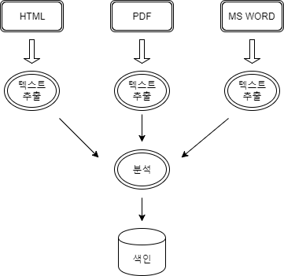
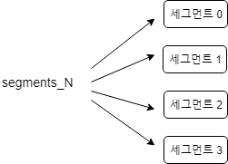

# Index

- <a href="#2.1"> 2.1 루씬 데이터 모델 </a>
- <a href="#2.2"> 2.2 색인 절차 </a>
- <a href="#2.3"> 2.3 기본 색인 작업 </a>


# 색인

색인은 잘 검색 하기 위한 과정!  
-> 색인의 목표는 **사용자에게 제공할 검색 서비스의 품질**  
-> 색인 작업에 너무 집중하기 보다는, 검색 과정에서 사용자에게  
더 나은 서비스를 제공하는게 훨씬 중요함!!  

---

<div id="2.1"> </div>  

## 2.1 루씬 데이터 모델


#### 문서와 필드

**문서**  
-> 루씬에서 색인과 검색 작업을 진행할 때, 한 건이라고 부를 수 있는 단위  
(하나 이상의 필드를 담고 있음)  

**필드**  
-> 필드마다 이름 : 값으로 이루어 짐

=> 'title:lucene' ? == title 이라는 필드에, lucene이란 단어가 존재하는  
문서를 찾는 것

> 필드를 기준으로 루씬이 처리하는 작업

- 필드의 내용을 색인할 지 말지 여부  
: 검색을 하기 위해서는 반드시 색인해야 함(텍스트)  
텍스트 분석 절차를 거쳐 토큰을 분리 -> 각 토큰을 색인에 추가
- 필드의 내용을 색인하는 경우  
: 필드마다 추가적으로 텀 백터(term vector)를 저장하게 설정 가능
(텀백터를 통해 특정 문서와 비슷한 문서를 찾아주는 등의 고급 기능 가능)
- 색인의 여부와 상관없이 필드 내용을 저장할지 여부  

#### 유연한 스키마
->루씬은 별도의 스키마가 존재하지 않음.(색인에 추가하려는 문서가 서로 완전히  
다른 필드를 가져도 문제가 되지 않음.)  
-> 색인에 추가하려는 정보는 모두 텍스트로 변환 & 비정규화(denormalize) 해야 함

#### 비정규화
색인할 때는 항상 루씬이 지원하는 문서 표현 방식에 맞춰 원본 파일을 적절하게 변형해야 함  
cf) XML(특정 태그 중첩) , Database(PK,FK,JOIN 등), OLE(다른 문서를 불러와 포함)  
BUT **루씬은 1차원적**  

---

<div id="2.2"> </div>  

## 2.2 색인 절차



### 2.2.1 텍스트 추출과 문서 생성
; 루씬은 원본 문서를 색인하려면, 먼저 텍스트를 추출하고 루씬 Document를 생성해야 함


### 2.2.2 분석
-> Field 객체에 내용을 담고 루씬 Document 생성  
-> IndexWriter 객체의 addDocument를 호출해 색인
-> Document 객체에 포함 된 텍스트를 모두 일련의 토큰(token)으로 분리  
  (\+ 설정에 따라 추가 작업 진행)
-> 일련의 여러 토큰 필터를 거침  
(LowerCaseFilter, StopFilter, PorterStemFilter 등등)

### 2.2.3 색인에 토큰 추가
입력된 텍스트를 토큰으로 변환 -> 역파일 색인(inverted index)이라는 구조에 저장  
-> *문서 안에 어떤 단어가 포함되어있는가 ?* 가 아닌,  
*X라는 단어를 포함하고 있는 문서는 무엇인가?* 의 대답을 찾는 데 최적화 된 자료구조

<br /><br />  

**색인 세그먼트**  

  
(각 세그먼트 자체로 개별적인 색인)

IndexWriter에서 추가하거나 삭제한 문서를 버퍼에 쌓아 두고 있다가, flush 시 새로운 세그먼트 생성  
-> 담당하는 기능에 따라 확장자를 지정  
e.g) 텀 백터를 담고 있는 파일 , 통합 색인 필드를 담고 있는 파일, 역파일 색인을 담고 있는 파일 등등  

- \_X.cfs  
  - 통합 색인 형식을 사용하면 \_X.cfs 파일로 들어감  
    (변경 시 IndexWriter.setUseCompoundFile 메소드로 설정)  
  - 통합 색인 형식을 사용하면 물리적으로 세그먼트마다 하나의 파일만 사용하지만  
    운영체제 차원에서 파일 개방 개수를 줄이는 효과가 존재.
- segments_\<N\> (generation, 세대)  
  - 색인에 변경사항이 있을 때마다 정수 N값 하나씩 증가

=> IndexWriter 클래스가 주기적으로 세그먼트 몇 개를 선택해 하나의 새로운 세그먼트로  
병합(MergePolicy,MergeScheduler 클래스) & 병합 된 기존 세그먼트는 삭제

---

<div id="2.3"> </div>

## 2.3 기본 색이 작업

### 2.3.1 색인에 문서 추가

- IndexWriter::addDocument(Document)  
: IndexWriter를 생성할 때 지정한 기본 분석기를 사용해 문서를 색인에 추가
- IndexWriter::addDocument(Document,Analyzer)  
: 인자로 지정한 분석기를 사용해 문서를 색인  
(색인과 검색 분석기가 다르면 원하는 결과를 얻지 못할 수 있음)

[Sample Code : ch2_index ](https://github.com/zacscoding/lucene-elasticsearch-example/blob/master/lucene/lucene-learn/src/main/java/com/lucene/learn/ch2_index/IndexingTest.java)

### 2.3.2 색인에서 문서 삭제

- deleteDocuments(Term) :: 지정한 텀을 포함하는 모든 문서를 삭제
- deleteDocuments(Term[]) :: 텀 배열 중, 하나라도 포함되는 문서 삭제
- deleteDocuments(Query) :: 지정한 질의에 해당하는 문서 삭제
- deleteDocuments(Query[]) :: 지정한 배열에 담긴 질의 중 하나라도 만족하는 문서 삭제
- deleteAll() :: 해당 색인에 들어있는 모든 문서 삭제

=> 하나의 문서만 삭제하고 싶을 때 :: 특정 이름의 Field를 추가 & 해당 Field의 값이  
색인 안에서 서로 유일  
=> IndexWriter.optimize() 차이

### 2.3.3 색인된 문서 변경
=> 루씬에서는 변경X (삭제 후 저장)  

- updateDocument(Term, Document) :: Term 객체에 해당하는 모든 문서를  
삭제하고, 해당 IndexWriter에 기본 설정된 분석기를 사용해 문서를 추가
- updateDocument(Term, Document, Analyzer) :: Term 객체에 해당하는  
모든 문서 삭제, 인자로 지정한 분석기를 사용해 문서를 추가


---

## 2.4 필드별 설정

### 2.4.1 색인 관련 설정

- Index.ANALYZED  
: 필드에 지정된 텍스트를 분석기에 넘겨 일련의 토큰을 뽑아내 각 토큰을  
검색할 수 있게 함(텍스트 필드에 사용하기 좋음)
- Index.NOT_ANALYZED  
: 역파일 색인에 추가하지만, 분석기로 텍스트 처리X (i.e 텍스트 통쨰로 토큰)  
(웹 페이지 URL, 파일 시스템 절대 경로, 날짜, 사람 이름, 주민번호, 전화번호 등)
- Index.ANALYZED_NO_NORM  
: Index.ANALYZED와 비슷 BUT norm 값을 색인에 저장하지 않음  
(norm 값은 색인 시 지정했던 중요도를 색인에 보관하지만, 검색 시 메모리 소모 더 큼)
- Index.NOT_ANALYZED_NO_NORM  
: Index.NOT_ANALYZED와 비슷한 설정이지만, norm 값을 색인에 저장하지 않음
- Index.NO  
: 해당 필드에 지정한 본문 텍스트는 색인하지 않는다.


### 2.4.2 필드의 원문 저장 관련 설정
; Field.Store.\*을 톨해 색인 시점에 필드에 추가했던 그대로 텍스트 원문을 색인 안에  
저장할 것인지 선택

- Store.YES  : 필드의 텍스트를 색인에 그대로 저장  
- Stores.NO  : 필드의 텍스트를 색인에 저장하지 않음  

=> 루씬은 CompressionTools를 통해 압축 및 해제 기능을 제공  
(텍스트의 길이가 별로 길지 않으면 소용X && CPU vs 하드디스크)  


### 2.4.3 텀 백터 관련 설정

- TermVector.YES : 문서에 들어있는 모든 유일한 텀과 문서 내에서의 텀 개수를 저장  
(이 설정으로는 위치나 오프셋 정보는 저장X)
- TermVector.WITH_POSITIONS : 문서에 들어있는 모든 유일한 텀과 문서 내에서의  
텀의 개수를 저장하고, 그와 함께 각 텀이 발견된 위치를 저장  
(이 설정으로는 오프셋 정보는 저장 X)
- TermVector.WITH_OFFSETS : 문서에 들어있는 모든 유일한 텀과 문서 내에서의  
텀 개수를 저장하고, 그와 함께 각 텀의 오프셋을 저장한다.  
(이 설정으로는 위치 정보를 저장하지 않음)
- TermVector.WITH_POSITIONS_OFFSETS : 문서에 들어있는 모든 유일한 텀과 문서 내에서의  
텀 개수를 저장하고, 그와 함께 각 텀이 발견된 위치와 오프셋을 모두 저장  
- TermVector.NO : 텀 백터 정보를 저장하지 않음


### 2.4.4 Reader, TokenStream, byte[] 필드  
; Field 클래스에는 몇 가지 다른 종류의 생성 메소드가 있으며, String 텍스트 대신  
다른 형태로 색인할 내용을 지정할 수 있음  

- Field(String name, Reader value, TermVector termVector)  
: String 대신 Reader 객체를 인자로 지정(필드의 내용을 색인에 저장할 수 없음)  
(String을 메모리에서 처리하기 부담스러울 때 유용)  
- Field(String name, Reader value)  
: 위와 동일하지만, 텀 백터를 저장하지 않게 TermVector.NO를 이용  
- Field(String name, TokenStream tokenStream, TermVector termVector)  
: TokenStream 객체로 미리 분석 절차를 거칠 수 있음.
- Field(String name, TokenStream tokenStream)  
: 위와 동일하지만 텀 벡터를 저장하지 않게 TermVector.NO 설정을 사용  
- Field(String name, byte[] value, Store store)  
: 이진 데이터를 저장할 때 사용  
(색인, 텀 백터 X & 저장하게 Store.YES를 지정)
- Field(String name, byte[] value, int offset, int length, Store store)  
: 바이트 배열 중 offset 인자와 length 인자에 해당하는 부분만 사용  

### 2.4.5 유용한 필드 설정 조합

<table>
  <tr>
    <td>색인</td> <td>저장</td> <td>텀 벡터</td> <td>사례</td>
  </tr>
  <tr>
    <td>NOT_ANALYZED_NO_NORM</td>
    <td>YES</td>
    <td>NO</td>
    <td>식별자(파일이름, DB PK등), 전화번호, 주민등록번호, URL, 사람 이름, 날짜 <br>
    정렬을 목적으로하는 필드</td>
  </tr>
  <tr>
    <td>ANALYZED</td>
    <td>YES</td>
    <td>WITH_POSITIONS_OFFSETS</td>
    <td>문서 제목, 문서 요약</td>
  </tr>
  <tr>
    <td>ANALYZED</td>
    <td>NO</td>
    <td>WITH_POSITIONS_OFFSETS</td>
    <td>문서 본문</td>
  </tr>
  <tr>
    <td>NO</td>
    <td>YES</td>
    <td>NO</td>
    <td>문서의 종류, DB의 기본 키(검색할 때 사용하지 않는 경우)</td>
  </tr>
  <tr>
    <td>NOT_ANALYZED</td>
    <td>NO</td>
    <td>NO</td>
    <td>숨겨진 키워드</td>
  </tr>
</table>

### 2.4.6 정렬 관련 설정
; 기본적으로 검색 질의에 따라 연관도를 계산해 연관도 순서를 정렬해서 가져옴  
=> 경우에 따라 원하는 조건에 맞춰 정렬해야 할 필요가 있음  
(이메일 보낸,수신 날짜별 // 메시지 크기 // 발신자 등)

- 필드의 값이 숫자  
=> NumericField 를 이용  
- 필드 내용이 텍스트  
=> Field.Index.NOT_ANALYZED
- 해당 필드에 중요도를 부여하지 않을 예정  
=> Field.Index.NOT_ANALYZED_NO_NORMS  

```
new Field("author", "Arthur C. Clark", Field.Store.YES, Field.Index.NOT_ANALYZED_NO_NORMS);
```

### 2.4.7 다중 값 필드  

가정 : 색인하고자 하는 문서에 저자 필드 존재 & 둘 이상의 저자가 존재한다고 가정  

> 1) 하나의 문자열로 연결  

> 2) 저자마다 별도의 필드 객체를 생성해 문서에 추가  

```
Document doc = new Document();
for(String author : authors) {
  doc.add(new Field("autho", author, Field.Store.YES, Field.Index.ANALYZED));
}
```  

=> 필드가 추가된 순서에 따라 토큰이 연결 된 것처럼 역파일 색인과 텀 벡터를 처리  


<br><br><br><br><br>  

---
