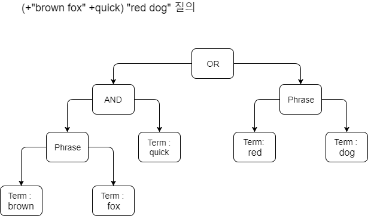

#### 3.5.1 Query.toString & 3.5.2 TermQuery

> Query.toString  == 쿼리를 확인하기 위해 사용

[example of source code]((https://github.com/zacscoding/lucene-learning/tree/unit/lucene-learn/src/main/java/com/lucene/learn/ch3_search/ParseQueryTest.java))

**주의** : 질의 표현식은 TermQuery를 생성하기 전에 분석기를 거침

> Query.toString & TermQuery

<pre>
    public void testToString() throws Exception {
        BooleanQuery query = new BooleanQuery();
        query.add(new FuzzyQuery(new Term("field", "kountry")), BooleanClause.Occur.MUST);
        query.add(new TermQuery(new Term("title", "western")), BooleanClause.Occur.SHOULD);

        assertEquals("both kind", "+kountry~0.5 title:western", query.toString("field"));        
    }

    public void testTermQuery() throws Exception {
        QueryParser parser = new QueryParser(Version.LUCENE_30, "subject", analyzer);

        Query query = parser.parse("computers");
        // term : subject:computers 출력
        System.out.println("term : " + query);
    }
</pre>

#### 3.5.3 텀 범위 검색
; [ TO ] or { TO } 를 통해 범위 검색

**노트**  
- QueryParser.setLowercaseExpandedTerms(false); 를 직접 호출하지 않는 이상  
소문자로 변경되어 검색
-범위 검색의 문자열은 분석기를 거치지 X ("없어도 오류)

#### 3.5.4 숫자와 날짜 범위 검색
; Lucene 3.0에서는 QueryParser 문법으로 NumericRangeQuery를 생성 X  
=> 필드마다 NumericField로 색인했는지의 여부를 기억하고 있지 않음  
(Check Version !!!)

> TermRangeQuery

<pre>
   // 텀 범위 검색
   public void testTermRangeQuery() throws Exception {
       // [Q TO V] : 양쪽 끝을 포함
       Query query = new QueryParser(Version.LUCENE_30, "subject", analyzer).parse("title2:[Q TO V]");      

       TopDocs matches = searcher.search(query, 10);
       assertTrue(TestUtil.hitsIncludeTitle(searcher, matches, "Tapestry in Action"));

       // { TO } : 양쪽 끝을 제외
       query = new QueryParser(Version.LUCENE_30, "subject", analyzer).parse("title2:{Q TO \"Tapestry in Action\"}");
       matches = searcher.search(query,10);

       assertFalse(TestUtil.hitsIncludeTitle(searcher, matches, "Tapestry in Action"));
   }
</pre>

---

#### 3.5.5 접두어 질의와 와일드카드 질의
; 텀에 (*) or (?)가 포함돼있으면, 해당 텀은 WildcardQuery로 변환

=> 단어의 맨앞에 와일드카드를 사용하면 성능이 급격히 떨어짐  
(setAllowLeadingWildcard 메소드를 통해 가능은 함)

<pre>
   // 접두어 , 와일드카드 질의
   public void testLowercasing() throws Exception {
       // PrefixQuery
       Query q = new QueryParser(Version.LUCENE_30, "field", analyzer).parse("PrefixQuery*");
       assertEquals("lowercased", "prefixquery*", q.toString("field"));

       QueryParser qp = new QueryParser(Version.LUCENE_30, "field", analyzer);
       qp.setLowercaseExpandedTerms(false);
       q = qp.parse("PrefixQuery*");

       assertEquals("not lowercased", "PrefixQuery*", q.toString("field"));
   }
</pre>

---

#### 3.5.6 불리언 연산자
; AND , OR , NOT (대문자)의 불리언 연산자 사용  
( 기본 OR  // NOT을 지정하면, 다른 텀이 있어야 함)

> 불리언 연산자 기호

<table>
  <tr>
    <th>문자열 형식</th>
    <th>기호 형식</th>
  </tr>
  <tr>
    <td>a AND b</td>
    <td>+a +b</td>
  </tr>
  <tr>
    <td>a OR b</td>
    <td>a b</td>
  </tr>
  <tr>
    <td>a AND NOT b</td>
    <td>+a -b</td>
  </tr>
</table>

> 기본 연산자를 AND로 지정

<pre>
  QueryParser parser = new QueryParser(Version.LUCENE_30, "contents", analyzer);
  parser.setDefaultOperator(QueryParser.AND_OPERATOR);
</pre>

---

#### 3.5.7 구문 질의
; 여러 텀이 큰 따옴표 안에 있으면 PhraseQuery로 변환  
(큰따옴표 안 문자열 -> 분석기..)

> 구문질의 및 슬롭

<pre>
   // 구문 질의
   public void testPhraseQuery() throws Exception {
       // -> "This is Some Phrase*"  
       // -> StandardAnalyzer 로 분석  
       // -> this, is 불용어로 제거 & 큰 따옴표의 우선순위가 *보다 높음  
       // -> "some phrase" 구문 질의 생성
       Query query = new QueryParser(Version.LUCENE_30, "field", new StandardAnalyzer(Version.LUCENE_30))
                   .parse("\"This is Some Phrase\"");

       assertEquals("analyzed", "\"? ? some phrase\"", query.toString("field"));

       query = new QueryParser(Version.LUCENE_30, "field", analyzer).parse("\"term\"");
       assertTrue("reduced to TermQuery", query instanceof TermQuery);
   }

   public void testSlop() throws Exception {
       Query query = new QueryParser(Version.LUCENE_30, "field", analyzer).parse("\"exact phrase\"");
       assertEquals("zero slop", "\"exact phrase\"", query.toString("field"));

       QueryParser queryParser = new QueryParser(Version.LUCENE_30, "field", analyzer);
       queryParser.setPhraseSlop(5);
       query = queryParser.parse("\"sloppy phrase\"");
       assertEquals("sloppy, implicitly", "\"sloppy phrase\"~5", query.toString("field"));
   }
</pre>

---

#### 3.5.8 퍼지 검색
; 물결(~,tilde)를 텀 뒤에 붙이면 해당 검색어로 퍼지 질의 생성  
(큰따옴표 있으면 구문질의 , 없으면 퍼지)  
-> WildcardQuery에서 설명했던 성능 문제가 FuzzyQuery에서도 발생

> 퍼지 검색

<pre>
// 퍼지 검색
public void testFuzzyQuery() throws Exception {
    QueryParser parser = new QueryParser(Version.LUCENE_30, "subject", analyzer);
    Query query = parser.parse("kountry~");
    // fuzzy : subject:kountry~0.5       
    System.out.println("fuzzy : " + query.toString());

    query = parser.parse("kountry~0.7");
    // fuzzy2 : subject:kountry~0.7
    System.out.println("fuzzy2 : " + query.toString());
}
</pre>

---

#### 3.5.9 MatchAllDocsQuery
; 질의 표현식으로 *:* 문자열을 입력하면, QueryParser -> MatchAllDocsQuery 질의를 생성

---

#### 3.5.10 질의 그룹
; 루씬의 불리언 질의를 사용하면, 복잡하게 중첩된 질의를 만들어 낼 수 있음

> (agile OR extreme) AND methodology 질의

<pre>
// 질의 그룹
public void testGrouping() throws Exception {
    Query query = new QueryParser(Version.LUCENE_30, "subject", analyzer)
            .parse("(agile OR extreme) AND methodology");

    TopDocs matches = searcher.search(query,10);
    assertTrue(TestUtil.hitsIncludeTitle(searcher, matches, "Extreme Programming Explained"));
    assertTrue(TestUtil.hitsIncludeTitle(searcher, matches, "The Pragmatic Programmer"));
}
</pre>

> (+"brown fox" +quick) "red dog" 질의

---

#### 3.5.11 필드 선택
;QueryParser에서 질의를 생성할 때, 기본 필드 이름을 지정하지만,  
이름의 제한은 없음

> field:(a b c)  => 필드 이름 : "field" , a or b or c (기본 OR)

---

#### 3.5.12 하위 질의에 중요도 지정
;캐럿(^,caret)으로 중요도 지정 가능

> junit^2.0 testing == junit 이라는 텀에중요도 2.0 , testing 은 기본 값

---

#### 3.5.13 QueryParser를 사용해야 하는가 ?

QueryParser로 생성할 수 없는 질의도 있고, 프로그램의 목적에 맞지 않을 수도 있음.  

=> ANTLR(http://www.antlr.org), JFlex(http://jflex.de/) 등의 소프트 웨어도 있고  
QueryParser 상속 후 일부 기능 추가 등등 많음

---

### Summary

- 3장의 기본 내장된 몇 종류의 질의와 검색 결과를 활용하는 방법 정도만 이해해도 충분
- 유사도 점수 계산은 질의와 가장 관련성이 높다고 판단되는 문서를 결과 맨앞으로 정렬하는 핵심  
- QueryParser는 사람이 작성한 질의 표현식 문자열을 해석해 최종 사용자에게 강력한 전문 검색 기능  
제공
- QueryParser는 일부 검색 성능 등에 문제가 될 가능성이 높은 부분이 있으니 문제점을 충분히 인지
