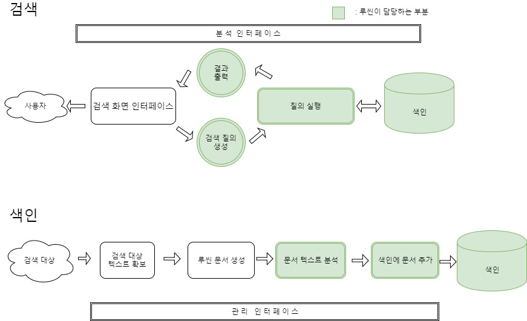
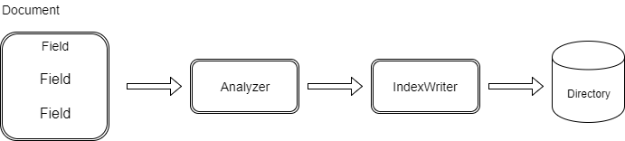

### 루씬과 검색 애플리케이션의 구조

**색인 과정 구성 요소**  

> 원본 문서를 색인(indexing) 한 결과물 == 색인(index)  
  : 간단히 특정 단어로 직접 이동할 수 있는 자료 구조  

- 검색 대상 텍스트 확보  
  : 문서 수집기(crawler, spider 등) 색인할 대상 문서를 모아옴
- 루씬 문서 생성  
  :  해당 원본을 루씬에서 사용하는 개별 단위(문서,document)로 변환
  ( + 루씬 문서 구성 // 필터 // 의미 분석 // 중요도 등 추가 작업 )
- 문서 텍스트 분석  
  : 텍스트를 토큰(token) 단위로 잘라냄
- 색인 문서에 추가  

**검색 과정 구성요소**  

- 검색(searching)  
  : 색인에 들어있는 토큰을 기준으로 해당하는 토큰이 포함 된 문서를 찾는 것
  - 정확도(precision)  
    : 검색 시스템에서 검색어와 관련 없는 문서를 얼마나 정확하게 제거하는 지
  - 재현율(recall)  
    : 검색 시스템에서 관련된 문서를 얼마나 빼먹지 않고 찾아주는 지  
- 검색 사용자 인터페이스  
  : 사용자가 직접 애플리케이션을 사용하면서 보는 화면  
<pre>
인터페이스는 최대한 간결하게 유지하는 편이 좋음.
-> 일관적인 검색어 입력 화면을 배치
-> 결과를 화면에 표시하는 방법도 중요
(글씨 크기, 너무 많은 결과 X, 정렬 기준 보여주기, 하이라이터 기능 등)
</pre>

- 검색 질의 생성  
  : 검색 엔진에서 인식하는 Query 객체로 변환하는 과정  
    (QueryParser 분석기 사용)
- 질의로 검색  
  : 색인을 뒤져 Query 객체에 해당하는 결과를 적당한 정렬 순서에 맞게 출력

**정보 검색분야의 세 종류의 이론적인 검색모델**  

<pre>
- 순수 불리언 모델  
  : 지정된 질의에 문서가 해당하는지 아니면 해당하지 않는지 판단.  
  별도의 점수 계산 없음. 검색 결과에 연관도 점수(relevance score)가  
  없으므로 정렬된 결과를 받을 수 없음.
- 백터 공간 모델  
  : 질의와 문서 모두 고차원 공간(각 텀이 하나의 차원)의 백터로 표현  
  백터 간 거리 계산을 통해 문서와 질의 사이의 연관도나 유사도(similarity)를 산출
- 확률 모델  
  : 확률적인 방법을 통해 개별 문서와 질의와 일치하는 지 확률을 계산  
=> 루씬에서는 *백터 공간 모델* 과 *순수 불리언 모델* 을 함께 사용
</pre>

- 결과 출력  
  : 사용자가 직관적으로 알아보기 좋게 화면에 출력

- 관리 인터페이스  
  : 루씬에는 관리 화면 인터페이스에서 사용할 수 있는 다양한 설정 기능이 API로 존재.

- 분석 인터페이스  
  : 웹 기반 or 보고 작성 엔진과 함께 별도의 서버에 설치 등등  
  루씬을 통해 아래와 같은 분석 정보를 제공  
  - 실행된 질의의 종류별 빈도수(단일 단어 질의, 구문 질의 ,불리언 질의 등)
  - 연관도가 낮은 결과를 뽑아 낸 질의
  - 사용자가 결과에서 아무 항목도 클릭하지 않은 질의(결과 클릭 추적)
  - 연관도 대신 별도의 필드 기준으로 정렬하는 빈도수
  - 루씬에서 검색하는 데 걸린 시간 내역 분석

- 시스템 확장  
  : 검색 어플리케이션의 확장성은 두 개의 차원(검색 대상 문서의 개수와  
    검색 질의 처리 속도)을 고려해야 함.  
    -> 샤드로 분리하고 각 결과를 취합하고 등등.. 하지만 여러 문제가 발생  
    -> 오픈소스를 사용 or 직접 구현 해야 함

---

### Example  

> 색인 프로그램  

[source code example](https://github.com/zacscoding/lucene-learning/tree/unit/lucene-learn/src/main/java/com/lucene/learn/ch1_intro)

<pre>
com.lucene.learn.ch1_intro.Indexer
com.lucene.learn.ch1_intro.Searcher
</pre>

---

### 색인 관련 핵심 클래스

- IndexWriter
- Directory
- Analyzer
- document
- Field

**IndexWriter**  
색인을 새로 하거나 기존 색인을 열고 문서를 추가 or 삭제 or 변경  
(색인의 내용을 검색하거나 꺼내 볼 수는 없음) 색인을 저장 할 공간은 Directory

**Directory**  
색인을 저장하는 공간

**Analyzer**  
색인 하기 전 분석기(analyzer)를 거쳐 단어로 분리해야 함  
색인 할 내용이 일반 텍스트가 아니면, 분석기를 통해 텍스트로 변환함(오픈소스 이용)

**Document**  
개별 필드(field)의 집합

**Field**  
색인의 각 문서는 모두 두 개 이상의 각자 이름이 지정된 개별 필드로 구성

---

### 검색 관련 핵심 클래스
- IndexSearcher
- Term
- Query
- TermQuery
- TopDocs

**IndexSearcher**  
검색을 담당하는 클래스

**Term**  
검색 과정을 구성하는 가장 기본적인 단위

**Query**  
Query 클래스를 상속받아 구현한 다양한 종류의 질의 클래스가 포함돼 있음  
(BooleanQuery, PhraseQuery, PrefixQuery, PhrasePrefixQuery, TermRangeQuery,  
NumericRangeQuery, FilteredQuery, SpanQuery 등등)

**TermQuery**  
가장 기본적인 기능의 쿼리 클래스  
(특정 필드에 원하는 단어가 들어 있는 문서를 찾아냄.)

**TopDocs**  
검색 결과 중, 최상위 N개의 문서에 대한 링크를 담고 있는 결과 클래스

---

### 정리
- 루씬은 단순한 검색 라이브러리  
(웹 문서 수집기, 문서별 텍스트 필터, 사용자 인터페이스 등을 포함 X)
- 루씬은 텍스트 기반으로 색인이 이루어짐
- Analyze -> Indexing -> Index <- search <- query
