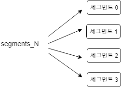

# 색인

색인은 잘 검색 하기 위한 과정!  
-> 색인의 목표는 **사용자에게 제공할 검색 서비스의 품질**  
-> 색인 작업에 너무 집중하기 보다는, 검색 과정에서 사용자에게  
더 나은 서비스를 제공하는게 훨씬 중요함!!  

---

## 2.1 루씬 데이터 모델

#### 문서와 필드

**문서**  
-> 루씬에서 색인과 검색 작업을 진행할 때, 한 건이라고 부를 수 있는 단위  
(하나 이상의 필드를 담고 있음)  

**필드**  
-> 필드마다 이름 : 값으로 이루어 짐

> 필드를 기준으로 루씬이 처리하는 작업

- 필드의 내용을 색인할 지 말지 여부  
: 검색을 하기 위해서는 반드시 색인해야 함(텍스트)  
텍스트 분석 절차를 거쳐 토큰을 분리 -> 각 토큰을 색인에 추가
- 필드의 내용을 색인하는 경우  
: 필드마다 추가적으로 텀 백터(term vector)를 저장하게 설정 가능
(텀백터를 통해 특정 문서와 비슷한 문서를 찾아주는 등의 고급 기능 가능)
- 색인의 여부와 상관없이 필드 내용을 저장할지 여부  

#### 유연한 스키마
->루씬은 별도의 스키마가 존재하지 않음.(색인에 추가하려는 문서가 서로 완전히  
다른 필드를 가져도 문제가 되지 않음.)  
-> 색인에 추가하려는 정보는 모두 텍스트로 변환 & 비정규화(denormalize) 해야 함

#### 비정규화
색인할 때는 항상 루씬이 지원하는 문서 표현 방식에 맞춰 원본 파일을 적절하게 변형해야 함  
cf) XML(특정 태그 중첩) , Database(PK,FK,JOIN 등), OLE(다른 문서를 불러와 포함)  
BUT **루씬은 1차원적**  

---

## 2.2 색인 절차

### 텍스트 추출과 문서 생성
; 루씬은 원본 문서를 색인하려면, 먼저 텍스트를 추출하고 루씬 Document를 생성해야 함

### 분석
-> Field 객체에 내용을 담고 루씬 Document 생성  
-> IndexWriter 객체의 addDocument를 호출해 색인
-> Document 객체에 포함 된 텍스트를 모두 일련의 토큰(token)으로 분리  
  (\+ 설정에 따라 추가 작업 진행)
-> 일련의 여러 토큰 필터를 거침  
(LowerCaseFilter, StopFilter, PorterStemFilter 등등)

### 색인에 토큰 추가
입력된 텍스트를 토큰으로 변환 -> 역파일 색인(inverted index)이라는 구조에 저장  
-> *문서 안에 어떤 단어가 포함되어있는가 ?* 가 아닌,  
*X라는 단어를 포함하고 있는 문서는 무엇인가?* 의 대답을 찾는 데 최적화 된 자료구조

**색인 세그먼트**  

IndexWriter에서 추가하거나 삭제한 문서를 버퍼에 쌓아 두고 있다가, flush 시 새로운 세그먼트 생성  
-> 담당하는 기능에 따라 확장자를 지정  
e.g) 텀 백터를 담고 있는 파일 , 통합 색인 필드를 담고 있는 파일, 역파일 색인을 담고 있는 파일 등등  

- \_X.cfs  
  - 통합 색인 형식을 사용하면 \_X.cfs 파일로 들어감  
    (변경 시 IndexWriter.setUseCompoundFile 메소드로 설정)  
  - 통합 색인 형식을 사용하면 물리적으로 세그먼트마다 하나의 파일만 사용하지만  
    운영체제 차원에서 파일 개방 개수를 줄이는 효과가 존재.
- segments_\<N\> (generation, 세대)  
  - 색인에 변경사항이 있을 때마다 하나씩 증가

=> IndexWriter 클래스가 주기적으로 세그먼트 몇 개를 선택해 하나의 새로운 세그먼트로  
병합(MergePolicy,MergeScheduler 클래스) & 병합 된 기존 세그먼트는 삭제

---

## 2.3 기본 색이 작업

- IndexWriter::addDocument(Document)
- IndexWriter::addDocument(Document,Analyzer)  
  (색인과 검색 분석기가 다르면 원하는 결과를 얻지 못할 수 있음)

[Sample Code : ch2_index ](http://https://github.com/zacscoding/lucene-learning/tree/unit/lucene-learn/src/main/java/com/lucene/learn/ch2_temp)

---

## 필드별 설정

### 2.4.1 색인 관련 설정

- Index.ANALYZED  
: 필드에 지정된 텍스트를 분석기에 넘겨 일련의 토큰을 뽑아내 각 토큰을  
검색할 수 있게 함(텍스트 필드에 사용하기 좋음)
- Index.NOT_ANALYZED  
: 역파일 색인에 추가하지만, 분석기로 텍스트 처리X (i.e 텍스트 통쨰로 토큰)  
(웹 페이지 URL, 파일 시스템 절대 경로, 날짜, 사람 이름, 주민번호, 전화번호 등)
- Index.ANALYZED_NO_NORM  
: Index.ANALYZED와 비슷 BUT norm 값을 색인에 저장하지 않음  
(norm 값은 색인 시 지정했던 중요도를 색인에 보관하지만, 검색 시 메모리 소모 더 큼)
- Index.NOT_ANALYZED_NO_NORM  
: Index.NOT_ANALYZED와 비슷한 설정이지만, norm 값을 색인에 저장하지 않음
- Index.NO  
: 해당 필드에 지정한 본문 텍스트는 색인하지 않는다.

---

     
temp
