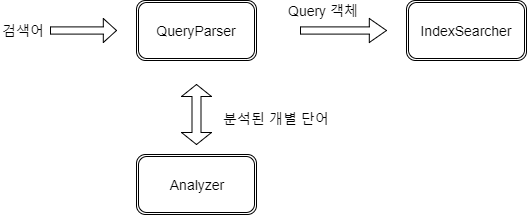
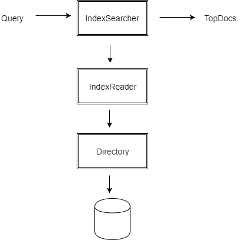

# 검색

- 루씬 색인의 문서 검색
- 다양한 루씬 내장 질의 활용
- 검색 결과 활용
- 연관도 점수 계산 방법
- 사람이 입력한 질의 변환

**루씬의 핵심 검색 API**  

<table>
  <tr>
    <th>클래스</th>
    <th>용도</th>
  </tr>
  <tr>
    <td>IndexSearcher</td>
    <td>색인을 검색하는 기능을 담당하는 클래스. 모든 검색 기능은 IndexSearcher인스턴스의
여러가지 search 메소드를 통해 진행
    </td>
  </tr>
  <tr>
    <td>Query(하위 클래스 포함)</td>
    <td>실제 Query 하위 클래스에서 특정 질의 기능을 구현. IndexSearcher의 search 메소드에 Query
객체를 직접 인자로 넘겨줄 수 있음
    </td>
  </tr>
  <tr>
    <td>QueryParser</td>
    <td>사람이 직접 입력하고 사람이 한눈에 알아볼 수 있는 텍스트 형태의 질의를 분석해 루씬
Query 객체로 변환</td>
  </tr>
  <tr>
    <td>TopDocs</td>
    <td>IndexSearcher.search 메소드에서 검색한 결과 중 연관도 점수가 가장 높은 결과 문서를
    담는 클래스</td>
  </tr>
  <tr>
    <td>ScoreDoc</td>
    <td>TopDocs 클래스에 담긴 검색 결과 하나를 나타내는 클래스</td>
  </tr>
</table>

---

#### 간단한 검색 기능 구현

[source example](https://github.com/zacscoding/lucene-learning/tree/unit/lucene-learn/src/main/java/com/lucene/learn/ch3_search)

"mock OR junit" 검색어를 QueryParser로 파싱하면, 투 개의 텀 질의를 담고 있는  
하나의 불리언 질의로 결과를 얻게 됨.

**QueryParser가 다룰 수 있는 표현식과 질의**  

<table>
  <tr>
    <th>질의 표현식</th>
    <th>다음과 같은 문서를 검색</th>
  </tr>
  <tr>
    <td>java</td>
    <td>기본 필드에서 텀 'java'를 검색</td>
  </tr>
  <tr>
    <td>java junit  java OR junit</td>
    <td>기본 필드에 텀 'java' or 'junit' 중 하나 이상을 포함하는 문서 검색</td>
  </tr>
  <tr>
    <td>+java +junit  java AND junit</td>
    <td>기본 필드에 텀 'java'와 'junit'을 모두 포함하는 문서 검색</td>
  </tr>
  <tr>
    <td>title:ant</td>
    <td>title필드에 'ant'텀을 포함하는 문서 검색</td>
  </tr>
  <tr>
    <td>title:extreme -subject:sports title:extreme 
    AND NOT subject:sports</td>
    <td>title : 'extreme' 텀을 포함하면서, subject 필드에 'sports'텀을  
    포함하지 않는 문서 검색</td>
  </tr>
  <tr>
    <td>(agile OR extreme) AND methodology</td>
    <td>기본 필드에서 'methodology' 텀을 포함하면서 동시에 'agile'이나 
    'extreme' 중 하나 또는 모두를 포함하는 문서 검색</td>
  </tr>
  <tr>
    <td>title:"junit in 
    action"</td>
    <td>title 필드에 정확하게 "junit in action" 구문을 포함하는 문서 검색</td>
  </tr>
  <tr>
    <td>title:"junit action"~5</td>
    <td>title 필드에서 'junit'과 'action'단어가 서로 다섯 단어 이내에 존재하는 문서 검색</td>
  </tr>
  <tr>
    <td>java*</td>
    <td>'java'로 시작하는 단어와 'java'를 포함하는 문서 검색</td>
  </tr>
  <tr>
    <td>java~</td>
    <td>'lava'처럼 'java와 비슷한 단어를 포함하는 문서 검색'</td>
  </tr>
  <tr>
    <td>lastmodified: 
    [1/1/09 TO 12/31/09]</td>
    <td>lastmodified 필드의 값이 2009년 1월 1일 ~ 2009년 12월 31일의 범위에 속하는 문서</td>
  </tr>
</table>

*IndexReader의 경우, 인스턴스 생성의 리소스 소모가 큼 -> 재사용 활용*

> reopen()을 활용한 IndexReader 인스턴스 얻기

<pre>
IndexReader newReader = reader.reopen();
if(reader != new Reader) {
  reader.close();
  reader = newReader;
  searcher = new IndexSearcher(reader);
}
</pre>

-> IndexSeacher 인스턴스를 생성하던 시점의 색인을 대상으로 검색 함

---

#### 3.2.2 검색 실행

=> IndexSearcher 인스턴스를 통해 search() 메소드 호출
=> 내부적으로 색인에 들어있는 모든 문서를 살펴보고 질의에 맞는 문서 찾고  
  해당 문서만 결과에 포함 & 결과 중 첫 번째 페이지에 해당하는 내용을 불러와 리턴

---

#### 3.2.3 TopDocs 결과 활용

> IndexSearcher의 주요 search 메소드

<table>
  <tr>
    <th>IndexSearcher.search 메소드 서명</th>
    <th>용도</th>
  </tr>
  <tr>
    <td>TopDocs search(Queery query, int n)</td>
    <td>최초에 몇 개 의 문서를 불러올 것인지</td>
  </tr>
  <tr>
    <td>TopDocs search(Query query, Filter filter, int n)</td>
    <td>색인에 있는 문서 중 지정한 필터에 해당하는 부분집합을 대상으로 검색</td>
  </tr>
  <tr>
    <td>TopDocs search(Query query, Filter filter, int n, Sort sort)</td>
    <td>지정한 필터에 해당하는 부분집합을 대상으로 검색 & sort</td>
  </tr>
  <tr>
    <td>void search(Query query, Collector results)</td>
    <td>검색 과정에 색인에 들어있는 문서를 조회하는 방법을 새로 구현하거나  
    정렬 기준에 따라 최상위 N개의 문서를 불러오는 대신 다른 기준으로 첫 번째 페이지를  
    확보하고자 하는 경우에 사용</td>
  </tr>
  <tr>
    <td>void search(Query query, Filter filter, Collector results)</td>
    <td>위의 메소드와 동일하지만, 지정한 필터에 해당하는 부분 집합만을 대상으로 함</td>
  </tr>
</table>  

> TopDocs 클래스의 메소드와 속성

<table>
  <tr>
    <th>TopDocs 메소드 또는 속성</th>
    <th>설명</th>
  </tr>
  <tr>
    <td>totalHits</td>
    <td>검색 결과의 건수</td>
  </tr>
  <tr>
    <td>scoreDocs</td>
    <td>결과를 담고 있는 ScoreDoc 객체의 배열</td>
  </tr>
  <tr>
    <td>getMaxScore()</td>
    <td>검색 도중에 점수 계산 작업을 진행한 경우 결과 중 가장 높은 점수를 알려준다 
    (특정 필드를 기준으로 정렬하는 경우 연관도 점수를 계산할지 말지 설정할 수 있음)
    </td>
  </tr>
</table>

---

#### 3.2.4 결과 페이지 이동
; 사용자가 페이지를 넘기는 횟수가 비정상적으로 많으면 설계 구조 다시 고려  
(대부분의 경우 사용자가 원하는 결과를 첫 페이지에서 찾을 수 있다면, 가장 최적의 검색 시스템!)

> 페이지 이동 기능 구현  

- 처음 검색 결과를 받아올 때, 해당하는 결과를 모두 받아온 후 사용자가 해당 검색  
결과를 보는 동안 ScoreDoc 배열과 IndexSearcher 인스턴스를 보관
- 사용자가 다른 페이지로 이동할 때마다 새로 검색

전자의 경우 사용자가 많으면, 검색 리소스를 보관하는 것도 서버에 부담이 큼.
후자의 경우 루씬의 검색 속도 + 운영체제 레벨의 파일 캐시를 통해 커버 가능

---

#### 3.2.5 준실시간(NRT, near real time) 검색

[[# sample- code]](https://github.com/zacscoding/lucene-learning/blob/unit/lucene-learn/src/main/java/com/lucene/learn/ch3_search/NearRealTimeTest.java)

### 3.3 연관도 점수
; 해당문서가 얼마나 질의와 일치하는 지 점수를 부여 후, 높은 점수 == 연관성 높은 문서

#### 3.3.1 점수 계산

**루씬의 유사도 점수 계산 공식**  
score(q,d)   =   coord(q,d)  ·  queryNorm(q)  · 	∑	( tf(t in d)  ·  idf(t)2  ·  t.getBoost() ·  norm(t,d) )
, where sigma index t in q

> 유사도 계산 공식 함수

<table>
  <tr>
    <th>항목</th>
    <th>설명</th>
  </tr>
  <tr>
    <td>tf(t in d)</td>
    <td>
    문서(d)의 텀(t)에 대한 텀 빈도수(TF, Term Frequence) 항목  
    해당 문서에 텀이 몇번이나 나타 나는지.
    </td>
  </tr>
  <tr>
    <td>idf(t)</td>
    <td>
      해당 텀의 역문서 빈도수(IDF, Inverse Document Frequence) 항목  
      텀이 얼마나 독보적인지 나타냄. (흔한 단어 일수록 idf 값은 낮아지고  
      찾아보기 어려운 단어일수록 idf 값이 높음)
    </td>
  </tr>
  <tr>
    <td>boost(t.field in d)</td>
    <td>
      색인할 때 지정했던 필드와 문서의 중요도 값. 중요도를 지정하면  
      다른 문서나 필드에 비해 특정 문서나 필드가 더 높은 유사도 점수를 가짐
    </td>
  </tr>
  <tr>
    <td>lengthNorm(t.field in d)</td>
    <td>
      필드 안에 속한 텀의 개수를 정규화한 값. (색인 과정에 계산해서 문서와 함께 
      색인 됨) 이 항목으로 인해, 필드 원문의 길이가 짧은 문서가 더 높은 유사도  
      점수를 받음.
    </td>
  </tr>
  <tr>
    <td>coord(q,d)</td>
    <td>
      질의에 지정된 텀 중 특정 문서에 포함된 텀의 개수에 따라 정해지는 조율 
      (coordination) 항목. 조율 항목을 통해 상대적으로 질의에 해당하는 텀을  
      더 많이 포함하고 있는 문서가 더 높은 유사도 점수를 받는다.
    </td>
  </tr>
  <tr>
    <td>queryNorm(q)</td>
    <td>질의의 각 텀에서 중요도의 제곱 합을 정규화 한 값.</td>
  </tr>
</table>

=> 개별 질의마다 추가적인 계산 항목이 들어갈 수 있음  
(queryNorm 항목으로 묶여 적용함)  
=> 질의 자체도 문서의 유사도 점수에 영향을 미침.(다수의 Query를 묶어서)  
(단일 질의 : 중요도가 전체 문서에 반영 되므로)  
=> Similarity 클래스를 통해 조정은 가능(기본 : DefaultSimilarity)

#### 3.3.2 explain() 메소드로 점수 내역 확인

> Explain

<pre>
package com.lucene.learn.ch3_search;

import java.io.File;

import org.apache.lucene.analysis.SimpleAnalyzer;
import org.apache.lucene.document.Document;
import org.apache.lucene.queryParser.QueryParser;
import org.apache.lucene.search.Explanation;
import org.apache.lucene.search.IndexSearcher;
import org.apache.lucene.search.Query;
import org.apache.lucene.search.ScoreDoc;
import org.apache.lucene.search.TopDocs;
import org.apache.lucene.store.Directory;
import org.apache.lucene.store.FSDirectory;
import org.apache.lucene.util.Version;

public class Explainer {
    private static String INDEX_DIR = "D:\\lucene\\resource\\lia2e\\build\\index";
    private static String QUERY_EXPRESSION = "junit";
    public static void main(String[] args) throws Exception {
        if(args != null && args.length == 2 ) {
            if(args[0] !=null) {
                INDEX_DIR = args[0];
            }            
        }

        Directory directory = FSDirectory.open(new File(INDEX_DIR));
        QueryParser queryParser = new QueryParser(Version.LUCENE_30, "contents", new SimpleAnalyzer());
        Query query = queryParser.parse(QUERY_EXPRESSION);
        System.out.println("Query : " + QUERY_EXPRESSION);

        IndexSearcher searcher = new IndexSearcher(directory);
        TopDocs topDocs = searcher.search(query, 10);
        for(ScoreDoc match : topDocs.scoreDocs) {
            Explanation explanation = searcher.explain(query, match.doc);
            System.out.println("---------------------------------");
            Document doc = searcher.doc(match.doc);
            System.out.println(doc.get("title"));
            System.out.println(explanation.toString());
            //System.out.println(explanation.toHtml());
        }

        searcher.close();
        directory.close();        
    }
}
</pre>

> Result  

<pre>

Query : junit
---------------------------------
JUnit in Action, Second Edition
0.7629841 = (MATCH) fieldWeight(contents:junit in 8), product of:
  1.4142135 = tf(termFreq(contents:junit)=2) // contents 필드 안에 junit 텀이 2개 존재
  2.466337 = idf(docFreq=2, maxDocs=13)
  0.21875 = fieldNorm(field=contents, doc=8)

---------------------------------
Ant in Action
0.61658424 = (MATCH) fieldWeight(contents:junit in 6), product of:
  1.0 = tf(termFreq(contents:junit)=1)
  2.466337 = idf(docFreq=2, maxDocs=13)
  0.25 = fieldNorm(field=contents, doc=6)
</pre>

 #### 3.4.1 TermQuery 텀 검색
 ;식별자 등으로 원하는 문서를 찾아와야 할 때 유용

> TermQuery

<pre>
  /**
    * Term Query Test
    */
   public void testKeyword() throws Exception {
       Directory dir = TestUtil.getBookIndexDirectory();
       IndexSearcher searcher = new IndexSearcher(dir);

       Term t = new Term("isbn","9781935182023");
       Query query = new TermQuery(t);
       TopDocs topDocs = searcher.search(query, 10);
       assertEquals("JUnit in Action, Second Edition", 1, topDocs.totalHits);

       searcher.close();
       dir.close();
   }
</pre>

> TermRangeQuery

<pre>
    /**
     * TermRangeQuery
     */
    public void testTermRangeQuery() throws Exception {
        Directory dir = TestUtil.getBookIndexDirectory();
        IndexSearcher searcher = new IndexSearcher(dir);

        // d* ~ j*
        TermRangeQuery query = new TermRangeQuery("title2", "d", "j", true, true); // boolean, boolean == contains
        TopDocs matches = searcher.search(query, 100);
        assertEquals(3,matches.totalHits);

        for(int i=0; i< matches.totalHits; i++) {
            Document doc = searcher.doc(matches.scoreDocs[i].doc);
            String title2 = doc.get("title2");
            assertNotNull(title2);
            char first = title2.charAt(0);
            assertTrue( first >= 'd' && first <= 'j' );            
        }

        searcher.close();
        dir.close();
    }
</pre>

=> 필요에 의해, TermRangeQuery에 Collector를 직접 지정할 수 있음  
=> BUT 직접 지정하면, 다른 순서로 범위를 찾아야 하므로 속도에 문제를 줄 수 있음.

 ---

#### 3.4.3 NumericRangeQuery 숫자 범위 검색
;숫자가 색인된 트라이 구조와 같은 형태로 동일한 공간에 맞게 질의의 범위를 변환

<pre>
    /**
     * NumericRangeQuery : inclusive
     */
    public void testInclusive() throws Exception {
        // TTC의 출간일 == 2006년 9월
        NumericRangeQuery<Integer> query = NumericRangeQuery.newIntRange("pubmonth", 200605, 200609, true, true);
        TopDocs matches = searcher.search(query, 10);
        assertEquals(1, matches.totalHits);        
        Document doc = searcher.doc(matches.scoreDocs[0].doc);
        String pubMonth = doc.get("pubmonth");
        assertTrue(pubMonth.compareTo("200605") >= 0);
        assertTrue(pubMonth.compareTo("200609") <= 0);                
    }
    /**
     * NumericRangeQuery : exclusive
     */
    public void testExclusive() throws Exception {
        // TTC 출간일 == 2006년 9월
        NumericRangeQuery<Integer> query = NumericRangeQuery.newIntRange("pubmonth", 200605, 200609, false, false);
        TopDocs matches = searcher.search(query, 10);
        assertTrue(matches.totalHits == 0);
    }
</pre>

=> NumericField에 사용한 것과 동일한 precisionStep 인자를 지정할 수 도 있음  
( 색인헀을 때랑 비교해서 주의!!)

---

#### PrefixQuery 접두어 검색

<pre>
    /**
     * PrefixQuery
     */
    public void testPrefix() throws Exception {
        // 하위 계층을 포함 해 검색 == startsWith("/technology/computers/programming")
        Term term = new Term("category","/technology/computers/programming");
        PrefixQuery query = new PrefixQuery(term);

        TopDocs matches = searcher.search(query, 10);
        int programmingAndBelow = matches.totalHits;
        System.out.println(programmingAndBelow);
        for(int i=0; i<programmingAndBelow; i++) {
            Document doc = DocumentUtil.getDocumentFromSearch(searcher, matches, i);
            assertTrue(doc.get("category").startsWith("/technology/computers/programming"));
        }

        // 하위 계층 제외하고 검색
        matches = searcher.search(new TermQuery(term), 10);        
        int justProgramming = matches.totalHits;
        System.out.println(justProgramming);
        assertTrue(programmingAndBelow > justProgramming);

        for(int i=0; i<justProgramming; i++) {
            Document doc = DocumentUtil.getDocumentFromSearch(searcher, matches, i);
            assertTrue(doc.get("category").equals("/technology/computers/programming"));
        }        

    }
</pre>

---

#### 3.4.5 BooleanQuery 불리언 질의
; 다양한 종류의 질의는 모두 BooleanQuery를 통해 복잡한 형태로 묶어 사용하고,  
BooleanQuery 안에 들어가는 각 질의는 절(clause)라고 부름

<pre>
    /**
     * BooleanQuery : and
     */
    public void testAnd() throws Exception {
        TermQuery searchingBooks = new TermQuery(new Term("subject","search"));        
        Query books2010 = NumericRangeQuery.newIntRange("pubmonth", 201001, 201012, true, true);

        BooleanQuery searchingBooks2010 = new BooleanQuery();
        searchingBooks2010.add(searchingBooks, BooleanClause.Occur.MUST);
        searchingBooks2010.add(books2010, BooleanClause.Occur.MUST);

        TopDocs matches = searcher.search(searchingBooks2010, 10);        
        assertTrue(TestUtil.hitsIncludeTitle(searcher, matches, "Lucene in Action, Second Edition"));        
    }

    /**
     * BooleanQuery : or
     */
    public void testOr() throws Exception {
        // 첫번째 카테고리
        TermQuery methodologyBooks = new TermQuery(new Term("category","/technology/computers/programming/methodology"));
        // 두번째 카테고리
        TermQuery easternPhilosophyBooks = new TermQuery(new Term("category","/philosophy/eastern"));

        // OR
        BooleanQuery enlightenmentBooks = new BooleanQuery();
        enlightenmentBooks.add(methodologyBooks, BooleanClause.Occur.SHOULD);
        enlightenmentBooks.add(easternPhilosophyBooks, BooleanClause.Occur.SHOULD);

        TopDocs matches = searcher.search(enlightenmentBooks, 10);
        System.out.println("or = " + enlightenmentBooks);

        assertTrue(TestUtil.hitsIncludeTitle(searcher, matches, "Extreme Programming Explained"));
        assertTrue(TestUtil.hitsIncludeTitle(searcher, matches, "Tao Te Ching \u9053\u5FB7\u7D93"));        
    }
</pre>

---

#### 3.4.6 PhraseQuery 구문 검색
omitTermFreqAndPositions 설정을 지정해 완전히 불리언 검색만을 필드로  
설정하지 않는 한, 루씬의 색인에는 기본적으로 텀의 위치 정보가 저장

> Example

가정 :
문장 : "the quick brown fox jumped over the lazy dog"
질의 : 'quick' 과 'fox'가 붙어있거나 그 사이에 최대 하나의 다른 단어를 포함하는  
문서 찾기

---

### 3.5 QueryParser로 질의 표현식 파싱
; API 메소드를 직접 호출해 질의를 생성하는 방법도 매우 강력  
BUT 모든 질의를 프로그램 레벨에서 자바 코드로 직접 구현해야하는 번거로움.

> e.g) +pubdate:[20100101 TO 20101231] Java AND (Lucene OR Apache)  
== Java텀을 가지고 있으면서 Lucene 이나 Apache 텀 중 하나를 가지고,  
2010년에 출간된 도서를 검색
